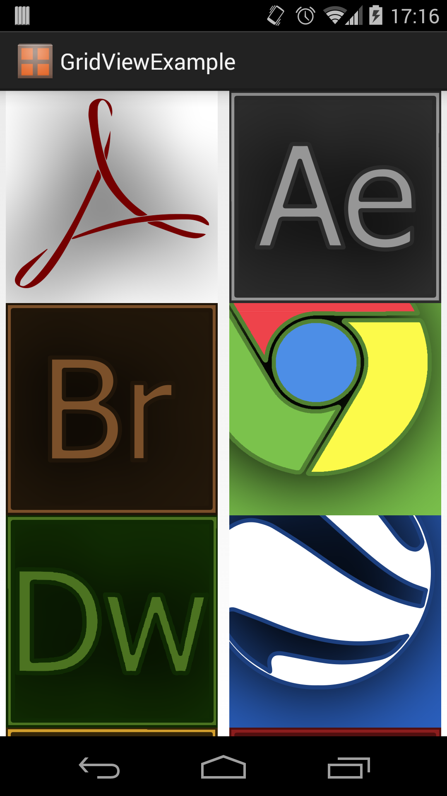

#Advanced Views - GridView
When showing a collection of items that have a unique visual representation, such as a collection of images, it's best to show these items in a grid to help emphasize that visual component.

While a ListView makes it very easy to show a collection of data in a uniform list and works really well for showing data that's text heavy, what if your data is more visual? A collection of images, for instance, is likely better represented by the image contents rather than the image name. To help show collections of visual content, Android provides the GridView control.

The GridView control is a type of AdapterView that shows content in a uniform grid. Where as a ListView can only show content in a single full width column, a GridView can use multiple columns with padding and spacing between each grid tile. Much like ListView, there are four components involved in creating a working grid: the GridView, the grid item layout, the backing data collection, and the adapter which binds it all together. The data collection is very much the same as the ListView, but we'll cover the other components below.

##Components

###GridView XML Resource
A GridView is defined in XML using the &lt;GridView /&gt; tag and specifying an ID, layout width, and layout height. As with lists, it's typical to have your grid stretch the full width and height of the layout. Additionally, there are a few other properties that you can set here. The numColumns property allows you to set how many columns your grid will contain. You don't set the number of rows since that's determined by the amount of data you have in your backing collection. The horizontalSpacing and verticalSpacing properties will allow you to define how much space you have between each tile in your grid. Likewise, you can set a fixed width for columns using the columnWidth property or you can set how columns stretch to fill any extra spacing using the stretechMode property. The below declaration will create a grid with two columns that are evenly spaced and distributed.

```
<GridView android:id="@+id/image_grid"
    android:layout_width="fill_parent"
    android:layout_height="fill_parent"
    android:numColumns="2"
    android:stretchMode="columnWidth" />
```

###Grid Item Layout
The grid item layout is the layout file that will determine what your grid items will look like. When creating this layout, it's important to keep the number of columns in your grid in mind. If your grid only has one column, you'll want to specify a wide layout. If your grid has many columns, you'll want to specify a more narrow layout. If you're going for a tile look, you'll want to make your grid items square. It's important to note that the same restrictions apply to grid items as they do to list items (no scrolling containers, keep text light, etc).

##Building a GridView
Now that you know about the different components involved in showing a visual grid, let's take a look at a practical example. For this example, we'll create an application that shows a list of application tiles. This is a fairly simple example, but it provides a good demonstration of how to create a simple GridView.

After creating a new project using the "Blank Activity" or "Empty Activity" templates, the first thing we'll need to do is define our GridView in a layout XML. Like with lists, it's a good practice to define your grid inside a layout to make it more flexible in the future.

```
<!-- activity_main.xml -->
<LinearLayout xmlns:android="http://schemas.android.com/apk/res/android"
    android:id="@+id/container"
    android:layout_width="match_parent"
    android:layout_height="match_parent" >
    <GridView android:id="@+id/image_grid"
        android:layout_width="fill_parent"
        android:layout_height="fill_parent"
        android:numColumns="2"
        android:stretchMode="columnWidth" />
</LinearLayout>
```

The next thing we need is a collection of images to show in the grid. We have some images in our drawable folders so we'll just define an array that holds the IDs for those images.

```
// Inside MainActivity.java
final int[] mImages = new int[] {
		R.drawable.acrobat, R.drawable.aftereffects, R.drawable.bridge,
		R.drawable.chrome, R.drawable.dreamweaver, R.drawable.earth,
		R.drawable.fireworks, R.drawable.flash, R.drawable.illustrator,
		R.drawable.indesign, R.drawable.photoshop, R.drawable.reader,
		R.drawable.steam
};
```

The last thing we'll need before hooking this all up with an adapter is a grid item layout. For this, we'll create a simple grid item using an ImageView with some preset properties.

```
<ImageView xmlns:android="http://schemas.android.com/apk/res/android"
    xmlns:tools="http://schemas.android.com/tools"
    android:id="@+id/grid_image"
    android:layout_width="fill_parent"
    android:layout_height="200dp"
    android:scaleType="centerInside"
    tools:ignore="ContentDescription" />
```

To hook all this up, we'll need to use a custom adapter that can handle image identifiers, as covered in the adapters section of this book.

```
// The rest of our MainActivity class.
public class MainActivity extends Activity {
	@Override
	protected void onCreate(Bundle savedInstanceState) {
		super.onCreate(savedInstanceState);
		setContentView(R.layout.activity_main);
		// Get the GridView by ID from the layout.
		GridView gv = (GridView)findViewById(R.id.image_grid);
		// Set an adapter for our grid.
		gv.setAdapter(new ImageAdapter(mImages));
	}
	private class ImageAdapter extends BaseAdapter {
		// The collection of image IDs that we'll be using in this adapter.
		private int[] mImageIds;
		public ImageAdapter(int[] _imageIds) {
			mImageIds = _imageIds;
		}
		// This method returns how many items are contained in the adapter collection.
		@Override
		public int getCount() {
			return mImageIds.length;
		}
		// This method returns a specific item from the adapter collection.
		@Override
		public Integer getItem(int _position) {
			return mImageIds[_position];
		}
		// This method specifies the ID of each view in the attached AdapterView.
		@Override
		public long getItemId(int _position) {
			return _position;
		}
		// This method returns the view that represents each item in the collection.
		@Override
		public View getView(int _position, View _convertView, ViewGroup _parent) {
			// If the passed in view is null, create a new one.
			// This view is typically null to start but will contain
			// a recycled view later on.
			if(_convertView == null) {
				_convertView = getLayoutInflater().inflate(
					R.layout.grid_item, null);
			}
			// Set our image to be the image ID at the specified position.
			ImageView iv = (ImageView) _convertView;
			iv.setImageResource(getItem(_position));			
			// Return our filled out grid item view.
			return _convertView;
		}
	}
	// Our image IDs
	final int[] mImages = new int[] {
			R.drawable.acrobat, R.drawable.aftereffects, R.drawable.bridge,
			R.drawable.chrome, R.drawable.dreamweaver, R.drawable.earth,
			R.drawable.fireworks, R.drawable.flash, R.drawable.illustrator,
			R.drawable.indesign, R.drawable.photoshop, R.drawable.reader,
			R.drawable.steam
	};
}
```

At this point, you should be able to run the app and see the images in the grid as seen below. For now, our grid tiles are very simple and only contain an image. Most grids will typically end up being this simple image or an image with some text across the bottom. Grids are meant to be visual, so try not to weigh them down too much with text.



####References

http://developer.android.com/reference/android/widget/GridView.html
