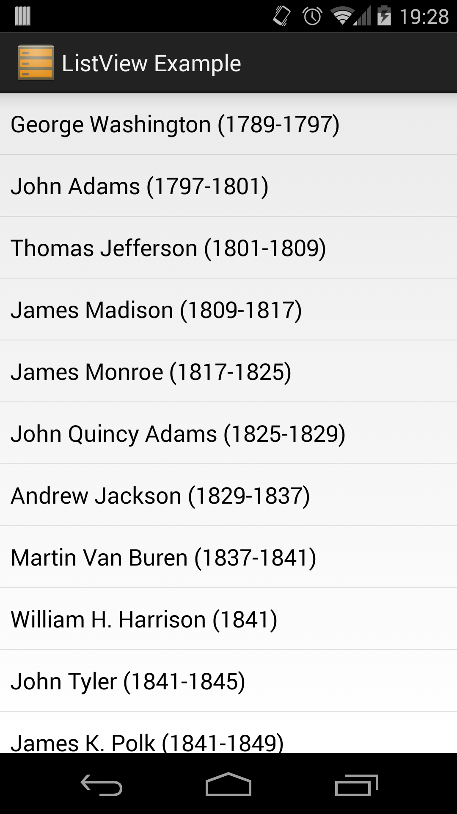

#Advanced Views - ListView

A very common UI pattern for displaying a group of related data is to show that data in a vertically scrolling list. To achieve this type of list display, you would use a ListView. The Android ListView is a special type of view group known as an AdapterView. Unlike other view groups where the views contained within are all determined via a layout file, such is the case with LinearLayout, an AdapterView creates its views on the fly based off the data contained within an adapter.

When using a ListView in your app, there are four components that we need to focus on: the ListView which will be used to show the list of data, the list item layout which will represent each row in the list, the collection of data to show in the list, and the adapter which hooks everything up. We'll go into each of these below with the exception of the adapter since that will be covered more in a later lesson.

*Note: In this lesson, you'll see a class called ArrayAdapter being used. For more on this and other types of adapters, see the section on adapter events and callbacks. For now, think of adapters as factories that take in a collection of data and return a list of views that represent that data.*

## Components

###List XML Resource
Defining a ListView in XML is just as easy as defining any other view element. Declare a new ListView using the &lt;ListView /&gt; tag and assign it an ID, layout height, and layout width. The key thing to keep in mind with a list is how it looks on the screen. On phones, or any narrow device, lists usually take up the full width of the screen. Also, if the core focus of a particular screen is the contents of the list, it's common to make the list the full height of the screen as well and not have any additional UI elements in your layout. As with any layout element, the size and position of your list will depend on what you're trying to accomplish with your UI, but these are just some general guidelines.

###Item XML Resource
The list item layout is the layout file that will specify how each row in your list will look. You can use just about any layout file you want for the list items, but there are a few guidelines you should follow. First of all, don't put any scrolling containers in your list items. A ListView is already a scrolling container and nesting scrollable containers can lead to the layout inflater throwing exceptions at best or creating layouts with inconsistent or broken scrolling behaviors at worst. Another thing to keep in mind is that list items are clickable. This means that you should never add elements to a list item that are also clickable. Nesting clickable items can lead to confusing experiences for the user. On the topic of clicks, Google recommends that all clickable UI controls are at least 48dp by 48dp in order for them to be easily clickable. Keep that in mind when creating your list items.

The last thing to keep in mind with list items is the amount of content shown. If your list item is showing text, you should not be showing more than three lines worth of text and not all lines should be the same size (more on this in the List Items resource below). In addition to text, it's common to show an image on list items. If the image is descriptive of the list item contents, the image should be left aligned. If the image is more of an extra decoration or minor content descriptor, it should be right aligned. 

*List items should never have arrows that point to the right on them. Using arrows at the end of list items is a common design feature on iOS but isn't on the Android platform. Be sure to keep your platform in mind when designing a layout.*

###Data Collection
At this point, you should be fairly familiar with how collections work so it should somewhat obvious that arrays and lists are the ideal collection types for working with a ListView. The reason for this is that they both store their elements in sequential, unchanging order and they both allow easy access to the contained elements via ordered indices. This allows your list to show items in a specific order that doesn't change as the user scrolls through the list items.

##Building the ListView
Now that you know about the different components involved in showing a list of data, let's take a look at a practical example. For this example, we'll create an application that simply shows a list of the presidents. This is a fairly simple example, but it provides a good demonstration of how the different pieces of a ListView work together.

After creating a new project using the "Blank Activity" or "Empty Activity" templates, the first thing we need to do is define our ListView in a layout XML. While it's possible to simply define the ListView as the only view in the layout, it's a good practice to wrap your list in a layout such as a LinearLayout. This way you can easily add in additional views later if needed without having to change the layout structure.

```
<!-- activity_main.xml -->
<LinearLayout xmlns:android="http://schemas.android.com/apk/res/android"
    android:id="@+id/container"
    android:layout_width="fill_parent"
    android:layout_height="fill_parent" >
    <ListView android:id="@+id/president_list"
        android:layout_width="fill_parent"
        android:layout_height="fill_parent" />
</LinearLayout>
```

The next thing we need is a collection of data to show in the list. Instead of creating one in code, we can just use the string resource file to create a string array. We'll make our string array hold a list of the presidents.

```
<!-- Inside strings.xml -->
<string-array name="politicians">
	<item>George Washington (1789-1797)</item>
	<item>John Adams (1797-1801)</item>
	...
	<item>Bill Clinton (1993-2001)</item>
	<item>George W. Bush (2001-2009)</item>
	<item>Barack Obama (2009-Present)</item>
</string-array>
```

At this point, all we need now is a list item layout to be able to hook this all up with an adapter. Instead of making our own list item layout, we'll just use one of the built-in layouts that the Android SDK provides. You can access any of the built-in SDK layouts using the android.R class which works exactly like your own project's R class. In this example, we'll use android.R.layout.simple_list_item_1 which is a simple TextView that has some padding on it and a minimum height of 48dp to make clicking each list item easier.

To hook this all up in code, we're going to use an ArrayAdapter. ArrayAdapter takes in either an array or ArrayList as the collection and an ID of the list item layout and everything is hooked up for you behind the scenes. We'll go more into how this is done in another lesson, so don't worry about that just yet. Once our adapter is hooked up with our list item layout and data collection, we need to hook up the adapter to the list. First, we fetch the list like we would any other view and assign it to a variable. Then we call setAdapter() on the ListView and pass in our adapter.

```
public class MainActivity extends Activity {
	@Override
	protected void onCreate(Bundle _savedInstanceState) {
		super.onCreate(_savedInstanceState);
		setContentView(R.layout.activity_main);
		// Grab our ListView by ID and assign it to a variable.
		ListView lv = (ListView)findViewById(R.id.president_list);
		// Get our data collection from the resource file.
		String[] presidents = getResources().getStringArray(R.array.politicians);
		// Create a new ArrayAdapter that takes in a context,
		// list item layout, and data collection.
		ArrayAdapter<String> adapter = new ArrayAdapter<String>(this, 
				android.R.layout.simple_list_item_1, presidents);
		// Hook everything up by setting the adapter to the ListView.
		lv.setAdapter(adapter);
	}
}
```

At this point, you should be able to run the app and see the data in the list as seen below. For now, our list items are very simple and only contain a single line of text. This is a limitation of the type of adapter we chose to use. To learn how to create more complex list items, read the lesson on Adapter Events and Callbacks.



####References
http://developer.android.com/reference/android/widget/ListView.html
http://developer.android.com/design/building-blocks/lists.html
http://developer.android.com/guide/topics/ui/declaring-layout.html#AdapterViews