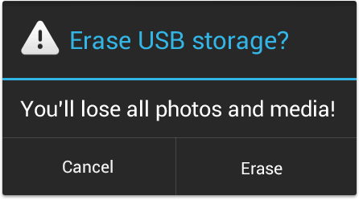
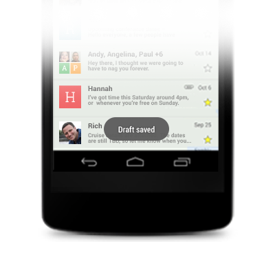

#User Notifications
Often times in the development of an app, you need to display a message or piece of data to the user for a short period of time. A warning that deleting some data can't be undone, confirmation that a message they typed up was successfully sent to another user, or an error message because the user didn't fully complete a registration form are all examples of when this might occur. Any sort of short running message like this should be presented to the user in a way that stands out from the rest of the app, and in a way that fits the message being presented. Generally, this shouldn't be something that impacts the standing UI or has permenant resident within the UI itself.  To facilitate this, there are two main ways of alerting the user, each with their own specific use cases.

##AlertDialog
The most commonly used method for alerting the user on Android is the AlertDialog. The AlertDialog class provides the developer with a quick and easy way of creating a dialog that can be used to display messages to the user. AlertDialogs are built using the AlertDialog.Builder class and typically contain basic dialog components such as a title, a message, and at least one button which can be used to dismiss the alert. The AlertDialog class also contains additional parameters that can be set to force the user to click a specific button to confirm they have seen a message before it is dismissed.

The dialog alert method is typically used when you want the user to acknowledge the alert message before it goes away. Dialog alerts take up a large portion of the screen and obscure the content underneath, which forces the user to pay attention to the message you're trying to show them. This method should be used for error messages that require the user to take a follow-up action such as correcting an input field or attempting a network request a second time. This method should also be used when asking a user to confirm an action before continuing and is commonly used to confirm data deletion.

##Toast
Another commonly used method for alerting the user is known as a Toast message. The Toast class provides the developer with a quick and easy way of creating a small pop-up that can be used to display short messages to the user. Toast messages are typically no more than a few words long and they disappear after a few seconds without user interaction.

The toast alert method is typically used when you want to confirm that an action has taken place or when you want to inform the user of an action that was taken that might not be very obvious. For instance, if your app stores data from a form, you might want to let the user know that their data was properly saved when they press the save button. In this case, you would save the data in the background and, when it's finished, let the user know that the data was saved by showing a short toast message. Another example would be an app that sends a message to another user. If your user types up a message that they decide they don't want to send, they'd discard the message. When the message is discarded, showing a toast that confirms the message was discarded can provide reassurance to your users that the message wasn't sent.

####References
http://developer.android.com/guide/topics/ui/dialogs.html
http://developer.android.com/reference/android/app/AlertDialog.html
http://developer.android.com/guide/topics/ui/notifiers/toasts.html
http://developer.android.com/reference/android/widget/Toast.html
