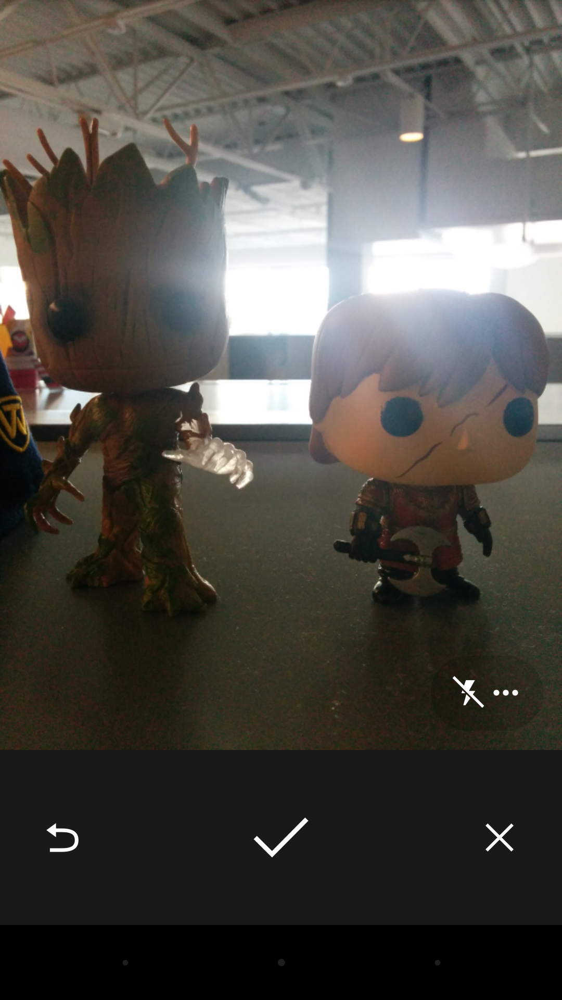

#Android Camera

Integrating camera photos into an app is a fairly common task when creating rich media apps. The big draw with apps like Facebook and Instagram is the ability to take a picture and share it with other users. In order to make this type of interaction possible, we need to first understand how to use the camera in our apps to take pictures. Once the picture is in our app, it's a simple ACTION_SEND intent to share the image to other apps or a network POST to send that data to a web server.

There are two ways to integrate the camera into an Android app, internal and external. The external method consists of launching an intent which opens the system camera app and getting the image that was returned. The internal method is much more complicated and involves integrating a camera preview directly into your app and implementing all of your own camera controls and image capturing code. For our apps, we'll focus on the external method. This is because, unless you're making an app where the sole focus is the camera, the internal method is just overkill.

##Implementation

The very first thing we need to do is tell the system what our app does and what capabilities are required. We'll be storing our images in external storage, so we'll need to request the READ_EXTERNAL_STORAGE and WRITE_EXTERNAL_STORAGE permissions in order for our saving/retrieving to work. Our app is also going to require the use of the camera. While it might seem like a given that all devices will have a camera, that's not entirely true. Android is being installed in TVs, cars, computers, and even game consoles. Most of those devices aren't going to have a camera available. In order to tell the system that our app needs a camera, or else it can't install, we use the &lt;uses-feature&gt; tag in the manifest. This goes inside the &lt;manifest&gt; tag, but outside the &lt;application&gt; tag.

```
<uses-feature android:name="android.hardware.camera"
    android:required="true" />
```

Once we've informed the system of our application's capabilities, we can then move on to starting the camera. Before that though, we need to consider what type of image we want to get. Do we want a full size image, or do we want a thumbnail? By default, the camera application will return a thumbnail. However, if we want a full size image, we have to specify an output location for the full size image. For our demo, we'll request a full size image, but we'll still account for the thumbnail in case we want to switch later.

To launch the camera app, we need to create an intent using the ACTION_IMAGE_CAPTURE action of the MediaStore class. This intent tells the system to open up whatever the default camera app is on the device and allow the user to take a single picture with that camera. We can launch this intent without setting any extras if want a thumbnail, but we want the full size image. To get that, we must set MediaStore.EXTRA_OUTPUT extra which is a URI that points to our output file.

```
Intent cameraIntent = new Intent(MediaStore.ACTION_IMAGE_CAPTURE);
cameraIntent.putExtra(MediaStore.EXTRA_OUTPUT, getOutputUri());
startActivityForResult(cameraIntent, REQUEST_TAKE_PICTURE);
```

Since we want a full size image, we need to first determine where we're going to save our image. If our image is meant to be private to our app and deleted when the app is uninstalled, we should store our images in protected external storage. However, most apps make their images available to the gallery, so we'll store our images in the default image directory on the device. You can get the default image directory from the Environment class and requesting the pictures directory. We'll also need a unique name for our images as to not overwrite any other images on the device. The one thing that's always unique, no matter how many times you request it, is the system time. We'll use that to name our files.

```
private Uri getOutputUri() {
	String imageName = new SimpleDateFormat("MMddyyyy_HHmmss")
		.format(new Date(System.currentTimeMillis()));
	File imageDir = Environment.getExternalStoragePublicDirectory(Environment.DIRECTORY_PICTURES);
	// Creating our own folder in the default directory.
	File appDir = new File(imageDir, "CameraExample");
	appDir.mkdirs();
	File image = new File(appDir, imageName + ".jpg");
	try {
		image.createNewFile();
	} catch(Exception e) {
		e.printStackTrace();
		return null;
	}
	return Uri.fromFile(image);
}
```

Now that we've defined our output file and launched our intent, the user will be presented with the camera app and be allowed to take a single picture. Once the user takes that picture, they'll be presented with three options, retake, confirm, or cancel. Retake allows them to simply retake the picture while completely discarding the first take. The confirm button closes the app and returns RESULT_OK to the starting activity while the cancel button returns RESULT_CANCELED.



Once the user has taken their picture, we can then handle that picture back in our activity (or fragment) using the onActivityResult() method. In that method, we'd look for our request code and check to make sure that the camera returned RESULT_OK. If the camera returns anything other than RESULT_OK, we'll do nothing. If the camera does return properly, there are two possible steps that we could take next. If we requested a thumbnail, the camera will return that thumbnail to our app as an extra named "data". We can get that extra, cast it to a Bitmap, and use it however we see fit. However, if we asked for a full size image, the camera will only return a result, but no data. In that case, we would simply load the image from the file we named as our output file.

```
@Override
protected void onActivityResult(int requestCode, int resultCode, Intent data) {		
	if(requestCode == REQUEST_TAKE_PICTURE && resultCode != RESULT_CANCELED) {
		if(data == null) {
			mImageView.setImageBitmap(BitmapFactory.decodeFile(mImageUri.getPath()));
		} else {
			mImageView.setImageBitmap((Bitmap)data.getParcelableExtra("data"));
		}
	}
}
```

##Adding to the Gallery
The final thing we would want to do after taking our picture, is adding that image to the system's gallery. You would think that just by saving our image in the gallery directory, that our image would be added. However, this is not the case due to how Android stores files in external storage.

Android's external storage is accessed using MTP or Media Transfer Protocol. MTP allows the Android system to grant certain applications access to certain types of files, regardless of the underlying file system and permissions. In order for the system to read your file using MTP, it first needs to know that it exists. To let the system know that your file exists, you need to scan the file using the media scanner. To do this, we create a new intent using the ACTION_MEDIA_SCANNER_SCAN_FILE action, give it the URI of the file to scan, and send it as a broadcast. The media scanner will receive this broadcast in the background, scan the file, and refresh the MTP reader on the device. Then, your photo will show up in the gallery along with all the other images on the device.

```
private void addImageToGallery(Uri imageUri) {
	Intent scanIntent = new Intent(Intent.ACTION_MEDIA_SCANNER_SCAN_FILE);
    scanIntent.setData(imageUri);
    sendBroadcast(scanIntent);
}
```

####References
http://developer.android.com/training/camera/photobasics.html
http://developer.android.com/guide/topics/media/camera.html