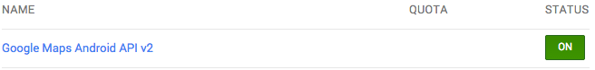

#Google Maps

Google Maps is the built-in mapping solution provided by Android and Google Play Services and a big part of making location aware applications that need to display data on a map. In Android, we would accomplish this using the Google Maps API. Google Maps is part of Google Play Services and is available on any Android device that has access to the Google Play Store. That means that, while Google Maps is available on most devices, it's not available on heavily modified versions of Android such as the one developed by Amazon.

##Obtaining an API Key

When developing an app that uses Google Maps, there are several things you must prepare before attempting to display a map. The first thing you need to do is create the project that you want to use Google Maps in and keep track of the package name you used, we'll need that later. The next thing you'll need to do is find the SHA-1 fingerprint of your debug signing key. Every Android application is signed with a debug signing key before it's loaded onto a device or emulator for testing. When you make a release build, you would use a release signing key. If you plan to make a release build, you'll need the SHA-1 fingerprint of that key as well. In order to determine the fingerprint of your signing keys, we'll need to open up a terminal window.

There are a couple of terminal commands we'll need to execute to navigate to our debug key and get the fingerprint of that key. Since most of you are likely not too comfortable with using terminal, we'll walk through each command one at a time at the end. The first thing we'll do is navigate to the folder that holds our debug key. This is a hidden folder in the root of our home directory named ".android". Inside of that folder you should see a bunch of files and/or folders related to your signing key and your emulator. One file should be named either "debug.keystore" or "debug.jks", this is your debug signing key.


Now that we've found the debug key, we need to get the fingerprint of it. To do this, you'll use the Java Keytool utility. This utility is used to both generate signing keys as well as give you information about existing signing keys. We'll run a keytool command on our signing key which will give us both the MD5 and SHA-1 fingerprints of our key. Make sure you're looking at the SHA-1 key and write it down. When running the below command, you will be prompted for a password. The default password for any Android debug key is "android". If that doesn't work, try entering no password as that is also the case at times. Be sure to keep your fingerprint a secret as it will be used to generate API keys later.


The full list of steps and commands to run:

Command - "cd ~/.android" - press return.
Command - "ls" - press return.
Verify that you have a debug.keystore or debug.jks file.
Command - "keytool -list -v -keystore debug.keystore" - press return.
When prompted for password, enter "android" and press return. If that does not work, rerun the above command and enter no password.
Copy down the certificate finger print labeled "SHA1" for future reference.
If you have a release key that you use for assignment submissions, be sure to get the fingerprint for your release key as well. In the terminal window, you would navigate to your release key by typing "cd " and dragging the containing folder into the terminal window and pressing return. Type "ls" and press enter to ensure you can see your release key in the folder. Then, run the command from step four replacing "debug.keystore" with the name of your signing key. The password for your release keystore will be whatever you set it to be when you created the key. If you don't remember the password, you'll have to generate a new key.

Now that we have our package name and our signing key fingerprint(s), we can generate an API key to use for Google Maps. To start, visit [https://code.google.com/apis/console/](https://code.google.com/apis/console/) and login to the Google Account you wish to use for development. Once you login, you should see a large "Create project..." button in the middle of the page. Click that button.


Once you create a project, you'll be taken to a list of available Google APIs. If you're not taken to that screen, click on the APIs & auth tab on the left side of the screen, then click on APIs. In the list of available APIs, scroll down until you find the one that says "Google Maps Android API v2" and turn it on by clicking the "OFF" button on the right side of the screen. The screen may appear slightly different for some people depending on whether or not you've logged into the developer console previously. You will have to accept the terms of service when attempting to enable Google Maps.



Once Google Maps has been enabled, click on the "Credentials" tab on the left side of the screen. On this page, you'll have the option to create an OAuth client ID or a public API access key. Select the "Create new Key" button under the public API access section. When prompted for a key type, select "Android key". In the resulting dialog, enter your SHA-1 fingerprint, followed by a semi-colon, followed by the package name for your app. Do this all on one line with no spaces. If you have a release key, press return to go to a new line and do the same thing for your release key fingerprint. Click the "Create" button and you should see a new section appear on the page labeled "Key for Android applications" with an "API KEY" that is 30-40 characters long. This is the API key we'll be using in our app.


Now that we have our API key, we can move back over to our application and start setting things up.

##Integrating Google Play Services

The first thing we'll need to do in our app is include the Google Play Services library. To do that, we need to first make sure that we have Google Play services and the Google repository downloaded. If you're unsure whether you've downloaded these or not, open up the SDK manager and download those two items. Next, you need to include Google Play Services as a library dependency. This is done differently depending on your IDE.


###Google Play Services in Android Studio

In Android Studio, importing Google Play Services is a lot less involved. To add Google Play Services as a dependency, start by opening up your project dependencies by going to File->Project Structure and clicking on the "Dependencies" tab at the top of the window. Click the "+" button in the bottom left corner and select "Library Dependency". Without searching, you should see an entry in the results window named "play-services" (not to be confused with "play-services-wearable"). Select this entry and click OK.


##Implementing Google Maps

Now that all of that setup is out of the way, we can finally start working on our app. We'll start by setting up the necessary permissions, features, and meta-data required by Google Maps in our manifest. In order to use Google Maps, you need three permissions for the map and two permissions for location data to go with the map. We'll declare usage of the INTERNET, ACCESS_NETWORK_STATE, WRITE_EXTERNAL_STORAGE, ACCESS_COARSE_LOCATION, and ACCESS_FINE_LOCATION permissions. Additionally, Google Maps uses OpenGL ES v2 to render the map, so we need to declare that with a &lt;uses-feature&gt; tag. Lastly, we'll need to setup two &lt;meta-data&gt; tags inside of our application to declare our Google Play Services version and our Google Maps API key. Our full manifest will look something like this:

```
<?xml version="1.0" encoding="utf-8"?>
<manifest xmlns:android="http://schemas.android.com/apk/res/android"
    package="com.company.android.mapsdemo"
    android:versionCode="1"
    android:versionName="1.0" >

    <uses-permission android:name="android.permission.INTERNET" />
    <uses-permission android:name="android.permission.ACCESS_NETWORK_STATE" />
    <uses-permission android:name="android.permission.WRITE_EXTERNAL_STORAGE" />
    <uses-permission android:name="android.permission.ACCESS_COARSE_LOCATION" />
    <uses-permission android:name="android.permission.ACCESS_FINE_LOCATION" />
    <uses-feature android:glEsVersion="0x00020000" android:required="true" />

    <uses-sdk
        android:minSdkVersion="14"
        android:targetSdkVersion="19" />

    <application
        android:allowBackup="true"
        android:icon="@drawable/ic_launcher"
        android:label="@string/app_name"
        android:theme="@android:style/Theme.Holo.Light.DarkActionBar" >
        <activity
            android:name=".MainActivity"
            android:label="@string/app_name" >
            <intent-filter>
                <action android:name="android.intent.action.MAIN" />
                <category android:name="android.intent.category.LAUNCHER" />
            </intent-filter>
        </activity>

        <meta-data android:name="com.google.android.gms.version" 
            android:value="@integer/google_play_services_version" />

        <meta-data android:name="com.google.android.maps.v2.API_KEY" 
            android:value="YOUR_API_KEY"/>
    </application>
</manifest>
```

