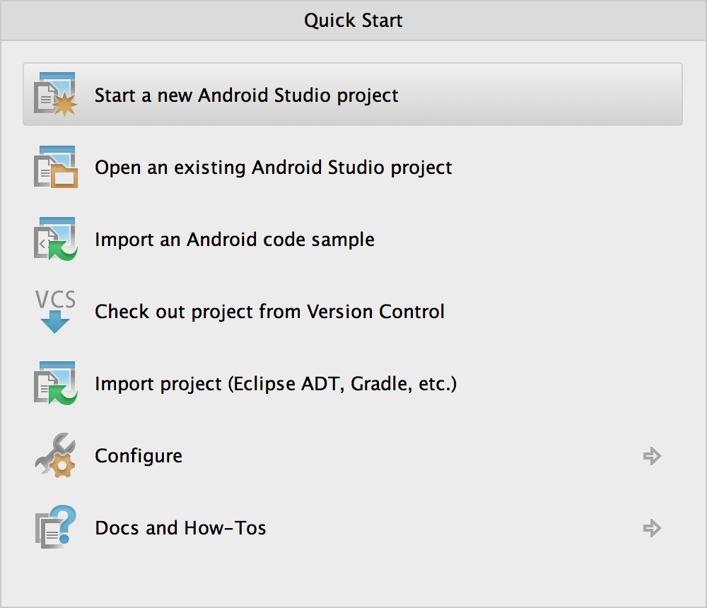
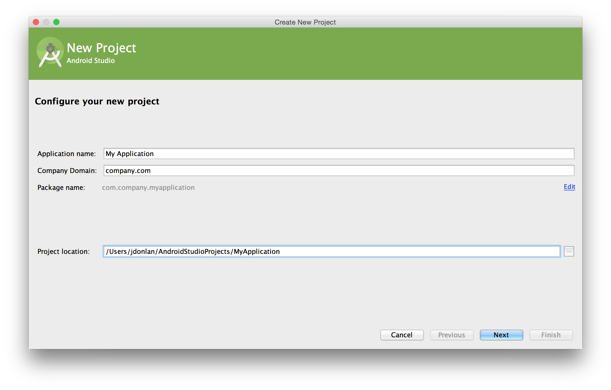
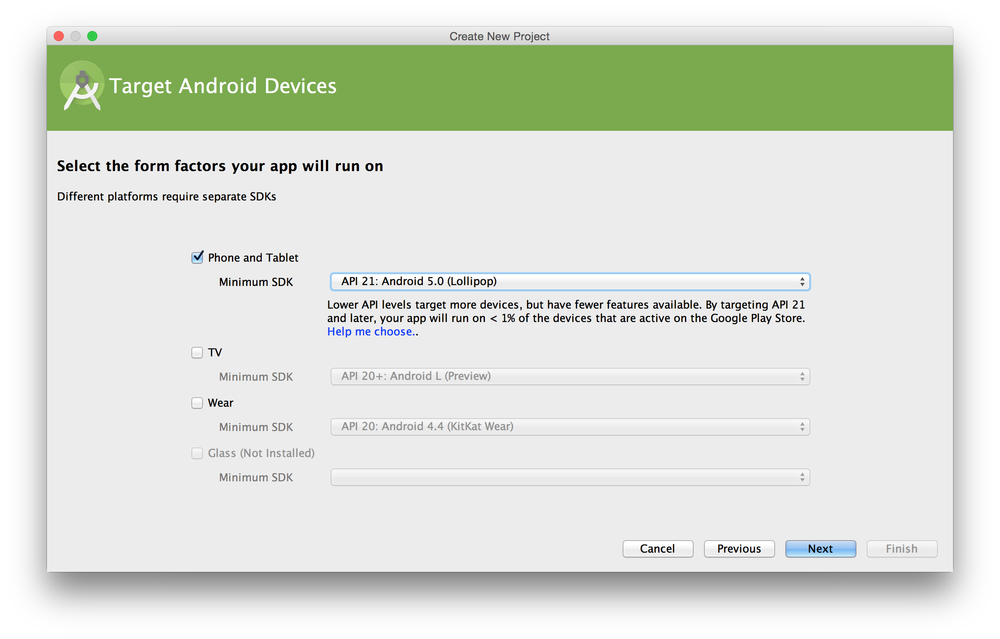
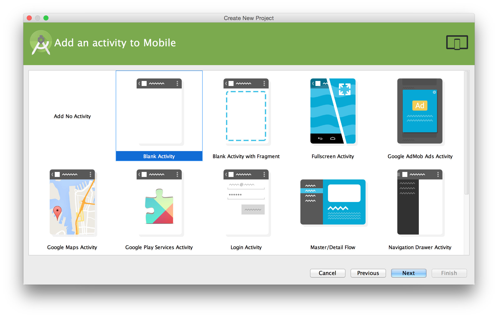
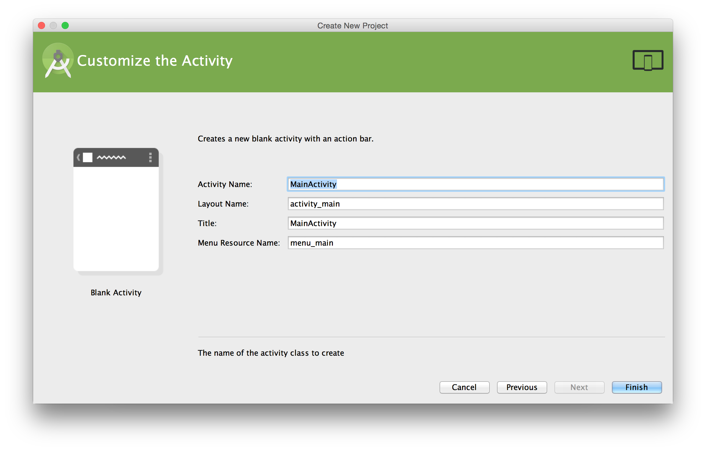

#Creating Your First Android Project
Once Android Studio is set up and configured with the Android SDK and JDK7 installed, it is time to create our first Android Studio project.  Opening Android Studio select "Start a new Android Studio project" from the Quick Start list to get started.



Once selected, you will be given the following screen which asks for a few pieces of information about your project.



Your **application name** should be appropriate for the project you're creating. This is not the name of your company, but the specific application you're building.  For example, Microsoft may use the name "Word" for the popular word processing application.  They wouldn't call it "Microsoft Word".

The **company name** is generally the website, without A name record, for the company.  That said, there are occasions when this may want to be more specific.  To use the Microsoft Word example above, the package may be named office.microsoft.com to further indicate that word is a part of their Office software suite.  The resulting package name for the example application would then be:

```
com.microsoft.office.word
```

Once finalized, select "Next" to proceed to the next configuration screen.



On this screen, you will select your intended device(s), as well as the corresponding SDK targets.  While learning Android development, you will want to use a recent API such as API 21: Android 5.0 Lollipop.  That said, when developing for an actual project, you will want to do research to identify the appropriate SDK targets.  Android is a worldwide platform with diverse device support and your audience may not all be on the latest version of the platform.

Once you have selected your target devices and SDI targets, click "Next" to proceed.



On this screen, you are presented with some template options to create your first activity from.  While there are a lot of exciting options, they are intended for advanced developers that already have a solid understanding of the Android platform and development patterns.  It is recommended that beginners select the simple "Blank Activity" option and start from there.



The last screen will give you the option to provide details for your activity.  The primary activity for an Android application is often named MainActivity, so this is pre-populated for you.  That said, you may need to rename this activity based on company policy, development standards, and so on.  

The **layout name** will be used to create an XML resource (covered in a later section) that houses your UI.

The **title** is the human readable title for your activity.  This can be seen in various areas of the application, including the top bar of the application.  It should be short and meaningful to the activity's purpose.

Finally, the **menu resource name**, like the layout name, will create an XML resource to house the menu options for your applications.  Menus will be covered later in the book.