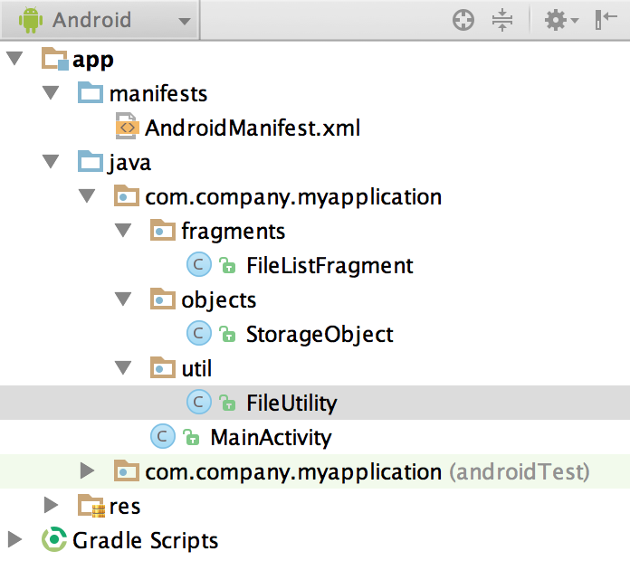

#Organizing Your Project
In Android, your package name is the unique identifier for your application. However, Java packages can also be used to organize code into specialized groupings. In this section, we'll discuss how to create a unique package name for your app and how to use Java packages to organize your code.

##Package Names

As covered previously, Android Studio will ask you to enter in a package name for your application. This package name will be used as the identifier for your app and must be unique to your specific application. With millions of apps already available on Google Play, it might seem like a daunting task to come up with a unique package name. There is, however, an easy way to come up with this name - reverse domain notation. 

Reverse domain notation is where you take your personal or company website, and reverse the domain. So for "company.com", the reverse domain would be "com.company". Starting your package name this way ensures that your app comes from you or your company, which will greatly limit the number of people using this package name. Since all package names need to be unique, you can't have more than one app with just your domain. It's good practice to add two more things to your package name, platform and project name. Java is a cross-platform language and, as such, can be used across desktop, the web, mobile, and any other device that supports a Java virtual machine. If you're building a Java app for Android and the desktop, it's a good idea to distinguish your projects by adding the platform in the package name. Lastly, you should always add your project name to the end of your package name to help identify the specific project.

###Example
Let's say we're building a calculator app for Android and the desktop. The package name for this would be the reverse domain, the platform, and the app name. A good Android package identifier might be:
```
com.company.android.calculator
```
While a good desktop identifier could be:
```
com.company.desktop.calculator
```
All of the apps you build in this book will be for Android so you can choose whether or not to include the platform, but it's helpful to denote platform if you work on any cross-platform apps in the future.

##Organizing Code
Once you've chosen a package name and created a new project, you'll notice that all of your ".java" files are located in a folder that has the same name as your package name. If you open this up on your file system, you'll notice that each period separated part of your package name is a different folder with a descending folder structure and your java files are located in the inner most folder. Java creates this folder structure for a number of different reasons, but one of the most helpful is for code organization.

By default, your ".java" files will all be located in the default package folder (the one named for your app's package). However, we can create sub-packages within the default package to help us organize different types of classes. For instance, you might want to put all of your app's Activity classes in the default package, but you might want to create a sub-package for all of your utility classes. You can see what this would look like in the image below. 



Be sure that when you create new packages, that the package name always starts with the default package. So if your app's package is "com.company.android.calculator" then you would want your utility class package to be "com.company.android.calculator.util" or something along those lines.

In the above image, the package name is "com.company.android.myapplication" which denotes that the app is made by a company, will be deployed to the Android platform, and is named My Application. As you can see, the default package containing our generated MainActivity.java file is listed first and all sub-packages start with the same name as the default package. Each sub-package is named to represent the type of classes contained within and helps to organize the classes into separate modules. 

In this simple example, four packages might seem like overkill. However, when you get to building more complex applications, sorting your class files in this way will greatly help you in organizing your code and increasing your productivity.

##Using Code in Other Packages
All classes that are part of the same package can access each other natively just by referencing the class name. However, classes contained in separate packages need to be imported first in order to access them. This means that, after we separate our code as seen above, in order for our MainActivity class to access the FileListFragment class, FileListFragment needs to be imported first.

Importing classes is done using the Java reserved keyword, import, followed by the class name with the fully qualified package name. In code, this would look like:

```
import com.company.android.myapplication.fragments.FileListFragment;
```

Notice that the import statement uses the full "com.company.android.myapplication.fragments" package name followed by the class name. The reason you use the full package name first is because the system needs to know where to locate the class file you want to import. 

Another way to import classes is to import the entire package. Let's say you need access to all classes in the fragments package but you don't want to import them all one at a time. To import the entire package at once, you replace the class name at the end of an import statement with a wildcard or * character. This would look like:

```
import com.company.android.myapplication.fragments.*;
```

Notice that instead of a class name at the end of the import, there is an asterisk instead. This tells the compiler to import all classes in the "com.company.android.myapplication.fragments" package for use in the MainActivity class.

You can also find more example imports at the top of your MainActivity class when creating a new project.

####References
[http://docs.oracle.com/javase/tutorial/java/package/namingpkgs.html](http://docs.oracle.com/javase/tutorial/java/package/namingpkgs.html)
[http://developer.android.com/guide/topics/manifest/manifest-element.html#package](http://developer.android.com/guide/topics/manifest/manifest-element.html#package)

