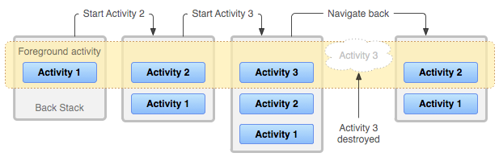

#Activity Stack
When launching a new activity on Android, the previously visible activity is moved onto what's known as the activity back stack. The back stack is a collection of activities that have been suspended by the system, but can easily be resumed. So when your app first launches, it's the only activity on the back stack. If you launch a new activity, that activity gets pushed on top of the stack with the previous activity existing just below it.

So how do things get onto and off of the stack? To start, each process in Android has its own back stack so, in most cases, each app has its own back stack as well. When an app starts for the first time, a new back stack is created with a single activity existing on top of the stack. If the user closes that activity using the back button or the finish() method of the activity, it's removed from the stack. When the stack is empty, the application closes.

If, instead, the application launches a new activity, then that activity gets pushed on top of the stack and becomes the new active activity. Only one activity can exist at the top of the stack at any given time since only one activity can be shown to the user at any one time. An illustration of what adding and removing activities from the back stack looks like behind the scenes can be seen below. In the diagram, we start with Activity 1 at app launch. Then our app starts Activity 2 which brings it to the top of the stack. Then we start Activity 3 which replaces Activity 2 at the top. Then, when the user presses back or Activity 3 calls finish(), Activity 3 is destroyed and the next activity in the stack, Activity 2, is brought back to the top.

This back stack behavior can be very useful when building natural navigation through your app. For instance, let's say we're building an app with two screens, a list screen and a form. The list screen will show a list of movies and the form will allow the user to enter in a new movie to show in the list. We start out by viewing the list screen which is currently at the top of the stack. When the user presses the add button, we the app launches the form screen to allow the user to enter in a movie. The form, when launched, is the new top of the stack with the list screen existing right below it.

Now, when the user saves a new movie in the form, where do we go? We could start the list screen again to show the updated list. This would make the list screen the top of the stack with the form screen below it and another list screen below the form. Then when the user presses back, they expect to be taken out of the app since the list was the first screen. Instead, due to how the back stack works, they're taken back to the form, then back to the list, then finally out of the app if they keep pressing back. Our other option would be, when the user saves the movie on the form, to finish the form activity. This would cause the form to come off the top of the stack and go back to the list that exists below it. Then you could use the onActivityResult() method as described in a previous lesson to update the contents of the list. Now, when the user presses back from the list, the app closes as expected since the list screen is the only activity on the stack.

Creating natural navigation using the activity back stack is very important. When your app first launches, the user will see your main screen. From then on out, the user will expect the back button to close the app if they are on that screen. If you create circular navigation, or multiple instances of a single activity on the back stack, this will lead to a confusing user experience. Additionally, having multiple instances of the same activity on the stack when they're not needed can lead to serious memory leaks.

For more information about how the back stack works, especially in the instance of having activities from multiple apps on the same stack, read the Tasks and Back Stack reference on the Android developer site that's linked in the references section.

####References
http://developer.android.com/guide/components/tasks-and-back-stack.html