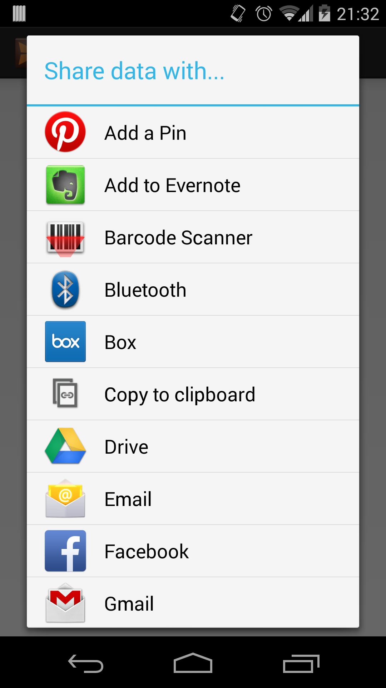

#Implicit Intents
Sometimes, instead of launching a specific activity or application, you'll want to let the system or the user decide which app to launch to perform a certain task. To do this, you can launch what's known as an implicit intent. For example, there are many applications that are baked into the OS that perform different functions that are beneficial to many other applications. One example would be how the Chrome browser can be used to view web links included in content from a news reader application.  Another example would be how Gmail and Email apps allow the user to send or share data from content applications through an email. Ultimately, the functionality of those apps is exposed to other applications through the use of implicit intents. 

The Intent class provides several different actions that can be performed by an Android app. These are very high-level or generic actions such as view, send, call, or edit, that can be handled by any app that declares itself as able to handle those actions.  Let's take a look at two of these common implicit actions.

##Sending Data
The send action, otherwise referred to as ACTION_SEND, allows an application to send data to any other application that can handle sending data. This could be your email app, Facebook, Hangouts, or any other data sending app. Since just about every data sending app supports this action, we can also narrow down which type of app we're looking for by specifying what type of data we want to send. We do this by giving our ACTION_SEND intent a type. This type refers to the mime type of your data. If you're sending text, you'd set your mime to be "text/plain" or "text/xml" depending on what type of text it was. You could also set your data to be an image with "image/png" or "image/jpeg". If you're sending text, which is the most common, the Intent class defines an extra you can set that will hold the text you want to send.

```
Intent sendIntent = new Intent(Intent.ACTION_SEND);
sendIntent.putExtra(Intent.EXTRA_TEXT, "Sharing this text!");
sendIntent.setType("text/plain");
startActivity(Intent.createChooser(sendIntent, "Share data with..."));
```
	
You might have noticed that after we set our action, text, and type, we started a chooser using Intent.createChooser(). A chooser will allow the user to decide which app handles the intent that you're trying to send. If you're attempting to launch an ACTION_SEND intent, the system will populate the chooser with all activities that can handle an ACTION_SEND intent with your type of data. If only one app exists that can open this data, that app will open without prompting the user first.



##Viewing Data
The view intent, otherwise referred to as ACTION_VIEW, allows applications to launch external viewing apps. So if you wanted to view an image, you could launch the system gallery. If you wanted to view a web link, you could open the Chrome browser. As with send intents, the app that is opened is determined by the type of data you're trying to view.

When declaring an ACTION_VIEW intent, you would set the data and/or type of your intent. The data for an intent is a Uri that points to the data you wish to view. This could be a file or web Uri. If you're setting a web Uri, you only need to set the data and the intent will set the type for you. However, if you're setting a file Uri, you'll need to set the type as well so that the system knows what the contents of the file are underneath.

```
// Open web Uri.
Intent viewIntent = new Intent(Intent.ACTION_VIEW);
viewIntent.setData(Uri.parse("http://www.google.com"));
startActivity(Intent.createChooser(viewIntent, "Open with..."));
// Open file Uri.
Intent viewIntent = new Intent(Intent.ACTION_VIEW); 
File file = new File("/some_directory/video.mp4");  
viewIntent.setDataAndType(Uri.fromFile(file), "video/*");  
startActivity(Intent.createChooser(viewIntent, "Open with..."));
```

####References
http://developer.android.com/guide/components/intents-filters.html#ExampleSend
http://developer.android.com/guide/components/intents-common.html