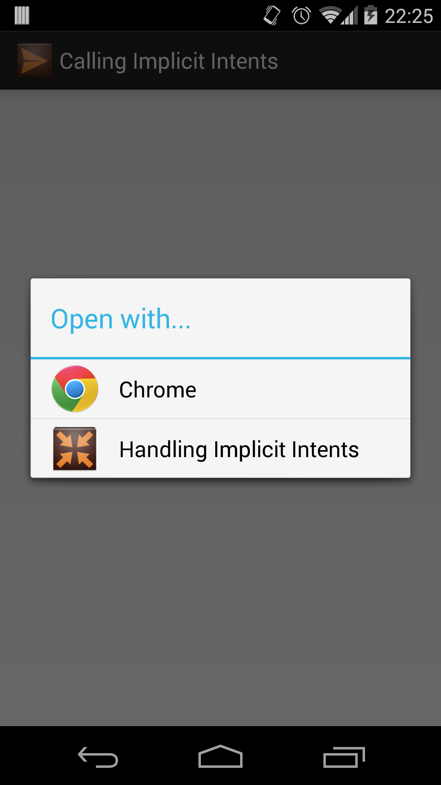

#Handling Implicit Intents
In addition to being able to launch an implicit intent, you can also designate activities in your own app as being able to handle implicit intents. Up until now, we've mostly ignored the &lt;intent-filter&gt; tag inside the manifest file. By default, this tag specifies a MAIN action and a LAUNCHER category. The intent filter tells the system that this activity is the main activity for the app (the app's starting point) and it should be shown in the system's app launcher. This should only ever appear in one of your app's activities as you would typically have only one starting point for a given app.

The MAIN/LAUNCHER intent filter is just one of many intent filters that you apply to your activity. For instance, if you want your app to be able to accept ACTION_VIEW intents, you could change your intent filter to accept the VIEW action instead of the MAIN action. Below we'll walk through an example of how to convert your intent filter to accept a VIEW intent that can be used to view web links.

###Example

We'll start this example off by creating a new application and we'll name our generated activity, MainActivity. In our manifest, this generates the following activity tag.

```
<activity
	android:name=".MainActivity"
	android:label="@string/app_name" >
	<intent-filter>
		<action android:name="android.intent.action.MAIN" />
		<category android:name="android.intent.category.LAUNCHER" />
	</intent-filter>
</activity>
```
	
As mentioned previously, the above intent filter is used to signify that this is the main activity for our app. Instead of being the main activity for the app, we'll change this to accept an ACTION_VIEW intent for viewing web data. To do this, we need to change a couple things. The first thing we change is the action tag. Instead of a MAIN action, we need a VIEW action. Then, we'd delete the LAUNCHER category as this activity won't appear in the app's launcher drawer. Instead, we'll add two new categories, DEFAULT and BROWSABLE. The DEFAULT category signifies to the system that this app can be used as a default viewer for data. This is important to set because the Chrome web browser is already set to be the system default. If you don't signal your activity to be a default, the system will just ignore your app and open Chrome. The BROWSABLE category then signals that this app can handle browsable links, such as web links. The last thing to do here is add a data tag that specifies a Uri scheme. This scheme refers to the beginning section of the Uri type you want to support. We're supporting web links, so we'll specify the "http" scheme.

```
<activity
	android:name=".MainActivity"
	android:label="@string/app_name" >
	<intent-filter>
		<action android:name="android.intent.action.VIEW" />
		<category android:name="android.intent.category.BROWSABLE" />
		<category android:name="android.intent.category.DEFAULT" />
		<data android:scheme="http" />
	</intent-filter>
</activity>
```
	
That's it! At this point, your activity will no longer show up as an app in the launcher drawer, but your app will instead show up in the chooser dialog when opening a web link. 



Now that are app is showing up in the chooser, we should probably make it actually handle and use the intent. Since we're handling web links, let's show those links in a WebView. In our layout, we'll define a simple LinearLayout that holds a WebView.

```
<LinearLayout xmlns:android="http://schemas.android.com/apk/res/android"
    android:layout_width="fill_parent"
    android:layout_height="fill_parent" >
    <WebView android:id="@+id/web_view"
        android:layout_width="fill_parent"
        android:layout_height="fill_parent" />
</LinearLayout>
```

Then, in our MainActivity class, we'll set this layout to be our view and get a reference to our WebView. The WebView widget requires that you set a web client to the view or else it'll just open all links in the default browser. So we'll set our web client to just be a default WebViewClient object. Now we can get the intent that opened this activity using getIntent() (like we would for data flow and intent extras), and get the data that was set. The data is a Uri so we convert that to a string using the toString() method and load that string, which should be our web link, in the WebView. Keep in mind that WebView requires the INTERNET permission to load http Uris, so be sure to declare that in the manifest.

```
public class MainActivity extends Activity {
	@Override
	protected void onCreate(Bundle savedInstanceState) {
		super.onCreate(savedInstanceState);
		setContentView(R.layout.activity_main);
		Intent intent = getIntent();
		Uri data = intent.getData();
		WebView wv = (WebView)findViewById(R.id.web_view);
		wv.setWebViewClient(new WebViewClient());
		wv.loadUrl(data.toString());
	}
}
```

At this point our app is fully capable of accepting ACTION_VIEW intents that contain web links. To do this with other intent actions, you would follow a very similar framework. You'd update the intent filter with actions and categories, set the type of data your activity accepts, and handle the intent in the activity. Try doing creating an intent filter that accepts an ACTION_SEND intent using what you know about intent filters and implicit intents.

####References
http://developer.android.com/guide/components/intents-filters.html#Receiving