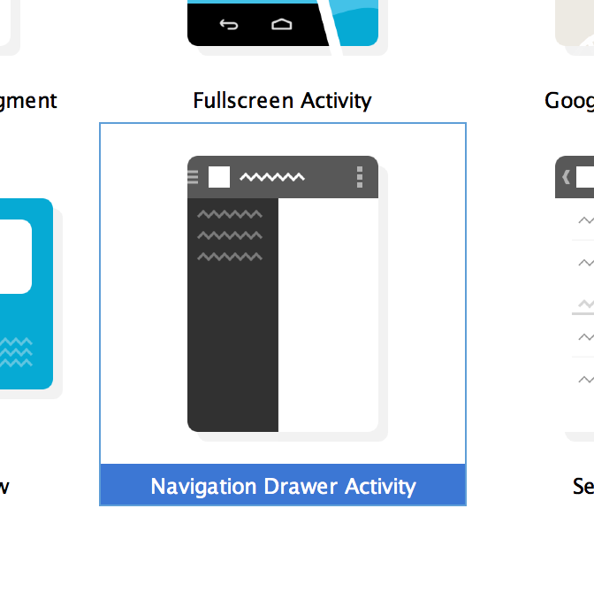

#Navigation Drawer
A navigation drawer is a slide out menu that allows the user to select the feature that they wish to access. The drawer slides out from the side of the screen, typically the left side, and displays a list of options for the user to choose from. This drawer can be a fairly complicated process on your own but, there is a template available in Android Studio and certain versions of Eclipse that will implement the drawer for you.

##Using the Template

When creating a new project, look for the project template called "Navigation Drawer Activity" and use that. Leave all of the file and class names as their default values for now so that you can follow along with the example below. Assuming you didn't change any values, you should have five files named MyActivity.java, NavigationDrawerFragment.java, activity_my.xml, fragment_my.xml, and fragment_navigation_drawer.xml. These five files work together to build an activity, that contains a drawer, that's powered by a list, which swaps out fragments based on selections in the list.

The first thing to examine when looking through the generated code is in the activity_my.xml file. You'll notice that the root element for this layout is a DrawerLayout. A DrawerLayout contains two components inside of it, a container layout, and a drawer element. The container layout should fill the entire screen width and height and is used to hold the fragments which will represent this screen. The drawer element, in this case it's a fragment, represents the layout for the drawer that slides in. To specify which side of the screen the drawer slides from, use the layout_gravity property. Setting the layout_gravity to be "right" instead of "left" or "start" will make the drawer slide out from the right instead of the left. Leave this as left for now as changing it will break some functionality in working with the drawer toggle buttons.

The next thing to look at is the NavigationDrawerFragment class located in the corresponding Java file. This fragment will display the list of options in the drawer as well as perform extra UI functions that conform to the user experience guidelines set by Android for working with a navigation drawer. These additional functions include switching out the title in the action bar when the drawer is open, hiding non-essential action bar items, altering the toggle indicator to be slightly smaller when the drawer is open, and showing a shadow over the UI in the background to draw more attention to the drawer.

Continuing through the drawer fragment, there are changes that can be made here to change the items that are shown in the drawer. In the onCreateView() method, an ArrayAdapter is created to setup the three default options in the drawer. You can replace these strings with your own to change the section names, or you can replace the adapter entirely to change how each section item looks. Scrolling down further, the drawer fragment is adding items to the action bar using the onCreateOptionsMenu() method. If you don't want the drawer to have its own menu items, you can delete this method. If you want to change those items, you can simply change the menu XML defined within.

The last thing you really need to focus on is in the MyActivity class. The MyActivity class implements an interface defined in the drawer fragment that is used to swap out fragments in the layout container when a drawer item is clicked. The activity overrides this method, which is named onNavigationDrawerItemSelected(), and places the proper fragment into the UI. By default, a placeholder fragment is used no matter which item is selected, but you can change this to be any fragment you want.

##When to Use the Navigation Drawer

Navigation drawers look really nice in an app and provide a way for users to navigate through your app without cluttering up the screen with navigation items. However, a navigation drawer is not always the end-all, be-all solution to navigation. For starters, you should use a navigation drawer only if you have more than three top level views. These are unique features in your app that are equally, or near equally, important as the next. Using a navigation drawer in this manner is commonly referred to as the navigation hub pattern as you're providing one central location for navigation to take place.

Another reason to use a navigation drawer, and this one is less important than the first, is if you absolutely just don't want to give up the vertical screen real estate that's taken up by tabbed navigation. When making this decision, weigh your options carefully. Does your app really require the vertical space? Would a drawer make the most sense? Don't make decisions based on what you want, make decisions based on what's best for the user.

####References
https://developer.android.com/design/patterns/navigation-drawer.html
https://developer.android.com/training/implementing-navigation/nav-drawer.html