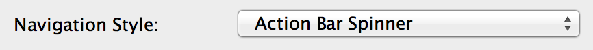

#Spinner Navigation
An action bar spinner allows the user to easily jump between views by selecting an option from a spinner that's located in the action bar (hence the name). This spinner works almost exactly the same as any other spinner control, but with a few different methods and interfaces/listeners. The implementation for an action bar spinner is actually much easier than a standard spinner, but Android Studio still provides a template to make sure everything is properly setup with a single click.

##Using the Template

When creating a new project, look for the project template called "Tabbed Activity" and use that. Leave all of the file and class names as their default values for now so that you can follow along with the example below, but change the navigation style to be "Action Bar Spinner". Assuming you didn't change any values, you should have three files named MyActivity.java, activity_my.xml, and fragment_my.xml. These three files work together to build an activity that contains a spinner in the action bar that can be used for navigation.

Of all of the navigation templates, this one is by far the simplest. Let's first take a look at the activity_my.xml file and examine the activity's layout. You'll notice that there's only one element here, a FrameLayout used as a fragment container. This layout is used to hold the fragment that represents the section selected by the action bar spinner.

Let's jump over to the MyActivity class now and see how the spinner is actually created. In the onCreate() method, the first thing we do is set our navigation mode to be a list navigation. List navigation is the mode that corresponds to using an action bar spinner. After that, we set the items in the spinner using an adapter (ArrayAdapter in this case) and set an OnNavigationListener to listen for navigation events. In this case, the activity implements the ActionBar.OnNavigationListener interface so our activity will do the listening.

After we setup the items and the listener, we implement the interface using the onNavigationItemSelected() method override. This method takes in the position that was selected, which can then be used to show the appropriate fragment using a fragment transaction. That's it! There's no complicated swipe behaviors or drawers to hide or show, just a simple spinner in place of the action bar's title.

##When to Use Spinner Navigation
The action bar spinner is certainly the easiest of the navigational constructs to implement, with or without a template. However, as always, it's not going to be the right navigational solution 100% of the time. Action bar spinners should be used in one of two situations. The first situation is when you have a single set of data that can be represented in several different ways. The spinner would then allow you to select how you want to display your data. This can be seen in the Google Calendar app where the action bar spinner switches your data view from day to week to month to agenda view. The other use case for an action bar spinner would be when you have multiple sets of data that are very similar in their contents, but distinctly different. This could be for switching account in an email app to show different inboxes or for filtering a giant set of data into different categories.

####References
https://developer.android.com/guide/topics/ui/actionbar.html#Dropdown