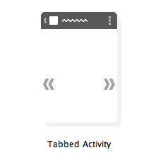
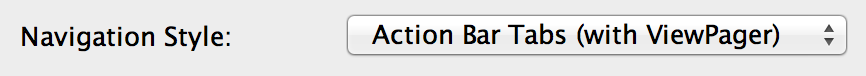

#Tabbed Navigation
Tabs in an application allow you to quickly access a feature of an app by popping up a label with the name of the feature on it. This is very similar to how folders work in a filing cabinet. The named tabs at the top of folders allow you to quickly find what you want without having to dig through each individual folder. In apps, tabs allow you to quickly find and access a certain feature without having to check each for the functionality you're looking for. Setting this functionality up on your own is a fairly painless, yet somewhat drawn out procedure. To make this easier for developers, Android Studio provides a template to make this easier.

##Using the Template

When creating a new project, look for the project template called "Tabbed Activity" and use that. Leave all of the file and class names as their default values for now so that you can follow along with the example below, but change the navigation style to "Action Bar Tabs (with ViewPager)". Assuming you didn't change any values, you should have three files named MyActivity.java, activity_my.xml, and fragment_my.xml. These three files work together to build an activity that contains tabs for navigation and allows for swiping between those tabs.

The first thing to examine when looking at an application with tabs is the activity_my.xml file which contains the layout for the generated activity. If you look at this layout file, you'll notice that there is only a single view contained within; a ViewPager. The ViewPager class is a type of layout that allows the user to swipe between different views or fragments as if they were pages of a book. Having this as the root of our layout allows us to not only just have clickable tabs for navigation but, to also allow the user to swipe between the views in those tabs.

Onto the MyActivity class, you'll find an inner class named SectionsPagerAdapter that extends FragmentPagerAdapter. This FragmentPagerAdapter class is a type of specialized adapter that's used in conjunction with a ViewPager to show fragments for each view in the ViewPager. This adapter is used to create and return fragments (currently only a placeholder fragment), get the total number of pages to swipe between, and get the title of each page in the ViewPager. The default app has three tabs, so the getCount() method returns 3 in this case. You can change this value to have more or less pages as well as change the getItem() method to change the type of fragment shown on each page.

Back in the onCreate() method of the activity, a few things are happening for our setup. The first thing that happens is that the action bar is set to use tabs for navigation. Then we create a new adapter for the ViewPager and assign it to that pager. Then, a SimpleOnPageChangeListener is attached to the pager so that everytime the user swipes, the listener can catch that and set the appropriate tab to be selected. Lastly, at the bottom of onCreate(), a new tab is added for each of the views in the ViewPager to create consistent navigation.

The last thing to point out here is that the MyActivity class implements the ActionBar.TabListener interface. This interface is used to detect when tabs are selected, unselected, and reselected (selected while still selected). This particular tab listener is setup to just change the current page in the ViewPager when clicked as that will change the fragment being displayed, but you can use the provided fragment transaction in each of the listener callbacks if you wanted to swap the fragments out manually (not recommended).

##When to Use Tabbed Navigation
Tabs are fairly straightforward to implement, but they're not always the right choice for navigation within an app. For starters, you should never have more than three tabs in an app for a single screen. This might seem odd with apps like the Google Play Store using way more than three "tabs" on some pages. However, those are considered scrollable tabs which differ from the fixed tabs implementation talked about above. Fixed tabs are only used for two or three main views or features while scrolling tabs are used to break related data up into categories or only view a portion of that data. Scrollable tabs are very common the wrong type of navigation for your app as you would need to have a ton of data for them to even make sense.

Another reason to use tabs is if you want your limited number of features to be accessed easily and very often or easily discovered by the user. With a limited set of features, you'd want to push your features up to the front so that users can easily find them and use them. As with any other type of navigation, make sure it makes sense in the context of the app. Don't pick a navigation method because it's easy to implement or looks nice, pick it because it makes the most sense for the app and the resulting user experience.

####References
https://developer.android.com/design/patterns/swipe-views.html
https://developer.android.com/training/implementing-navigation/lateral.html