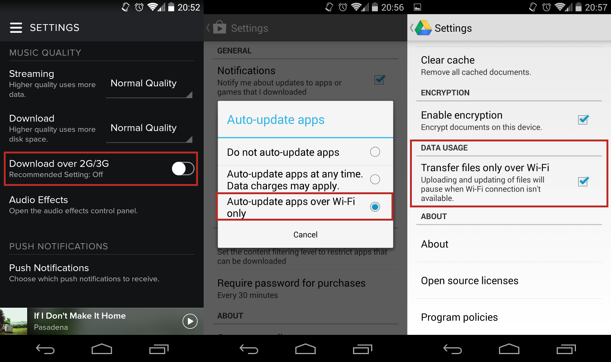

#Network Status
When building an application that uses one of these remote data connections, it's important to first check if that connection is available.  Without a network connection, an application is exposed to potential errors or erratic behaviors if not properly handled.

To check if a network connection is available, we'll be using the Android ConnectivityManager class. The connectivity manager is one of many Android system services that allows you to access information from various pieces of device hardware and sensors. To get the connectivity manager as a system service, we must request it using a context. As all activities are also contexts, we can access this using the activity subclass in much the same way as you would a layout inflater service.

```
public class MainActivity extends Activity {
	@Override
	public void onCreate(Bundle _savedInstanceState) {
		super.onCreate(_savedInstanceState);
		// Get the connectivity manager as a system service.
		// The Context class provides several string constants for 
		// accessing various system services.
		ConnectivityManager mgr = (ConnectivityManager)getSystemService(Context.CONNECTIVITY_SERVICE);
	}
}
```

Once we have our instance of the connectivity manager, we can then check to see if we have a network connection and what type of connection it is. Android devices have the ability to connect to several different network types, but the most common ones you'll see are mobile (3G/4G) and WiFi which correspond to the connectivity manager constants, TYPE_MOBILE and TYPE_WIFI. To find out if we're connected, we must first request the active network information. We can do this using the getActiveNetworkInfo() method.

```
// Getting our connectivity manager.
ConnectivityManager mgr = (ConnectivityManager)getSystemService(Context.CONNECTIVITY_SERVICE);
// Getting our active network information.
NetworkInfo netInfo = mgr.getActiveNetworkInfo();
```

The getActiveNetworkInfo() method returns to us a NetworkInfo object that contains all information about our current network connection. If getActiveNetworkInfo() returns null, that means we have no connection. If it doesn't return null then that means a network is connected, but that network doesn't necessarily have a data connection. Using the returned NetworkInfo object, we can check connection type using getType() and we can check if we have a data connection of this type by calling isConnected().

```
// Getting our connectivity manager.
ConnectivityManager mgr = (ConnectivityManager)getSystemService(Context.CONNECTIVITY_SERVICE);
// Getting our active network information.
NetworkInfo netInfo = mgr.getActiveNetworkInfo();
// We have a network connection, but not necessarily a data connection.
if(netInfo != null) {
	if(netInfo.getType() == ConnectivityManager.TYPE_MOBILE) {
		// We're on 3G/4G data
	} else if(netInfo.getType() == ConnectivityManager.TYPE_WIFI) {
		// We're on WiFi data
	}
	if(netInfo.isConnected()) {
		// We have a valid data connection
	}
}
```

For most applications, isConnected() should be thorough enough as you won't care what type of network connection you have, so long as it's a data connection. If you're going to be downloading large files, however, you'll want to make sure that you don't eat up too much of your user's data plan without their consent. Performing large data transactions over mobile networks can eat up a user's data plan allowance which costs them money and can lead to them uninstalling your app. Therefore, if you're performing large data transfers over a network, you'll want to make sure that you only perform them over WiFi by default. However, it is always best practice to give the user the ability to allow data connections over mobile or cellular networks, overriding the default value. For an example of what this looks like, try viewing the settings for popular apps such as the Google Play Store, Google Drive, and Spotify.



This whole process of checking network type and network connectivity might seem a bit tedious, but it's a very important step in providing a good user experience. If you don't check for connectivity, your data connections will still work so long as a connection exists. However, by checking for connectivity before attempting to make a connection, you can give your user information about connection status. 

If an attempt to make a network connection fails, for instance, there are numerous reasons which could be the fault. The best you can do at that point is tell the user to try again. If the device doesn't have a data connection, however, trying again isn't going to do anything but cause another failure, frustrating the user. If you instead check for connectivity before making a data connection, you'll know immediately if the connection is the problem. If it is, you can inform the user and they can attempt to switch connections to one that works, or try the operation again once they get to a working connection.

####References
http://developer.android.com/training/monitoring-device-state/connectivity-monitoring.html
http://developer.android.com/reference/android/net/ConnectivityManager.html
http://developer.android.com/reference/android/net/NetworkInfo.html
