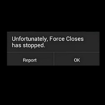

#Understanding Threads
A thread is a single unit of execution within a process or application. When an app is launched, the system creates a process for it to run in way down at the operating system level. By default, each process has a single thread associated with it, called the main thread, that handles all code execution within the app.

##The Main Thread
The main thread is the first thread that is started when your app is launched in a new process. This is responsible for drawing UI components, handling lifecycle and click events, and executing all code that exists within any of the associated methods. In Android, this is often referred to as the UI thread since all UI code happens on the main thread. Every component in an app shares the same main thread so long as they share the same process. As such, everything that happens in your app, including drawing the UI, is queued up as a message and the main thread will pull those messages from the queue and execute them one at a time. 

##Application Not Responding
If long operations are performed on the UI thread, messages won’t be pulled off the queue very quickly which can lead to your app slowing down or triggering an **ANR** (app not responsive).

ANR, or Application Not Responding, is an error state that is triggered when long running operations block the main thread for more than five seconds.  When triggered a dialog that prompts the user to either close your app or wait for the operation to finish as seen below:

###Preventing ANR

It should be noted that the threshold for users detecting slowness in an app is around 100-200ms. Operations on the main thread should not take longer than this. For simple operations, try and optimize code as best as possible. For longer running operations, move those operations to a background thread.

####References
http://developer.android.com/guide/components/processes-and-threads.html
http://developer.android.com/training/articles/perf-anr.html
