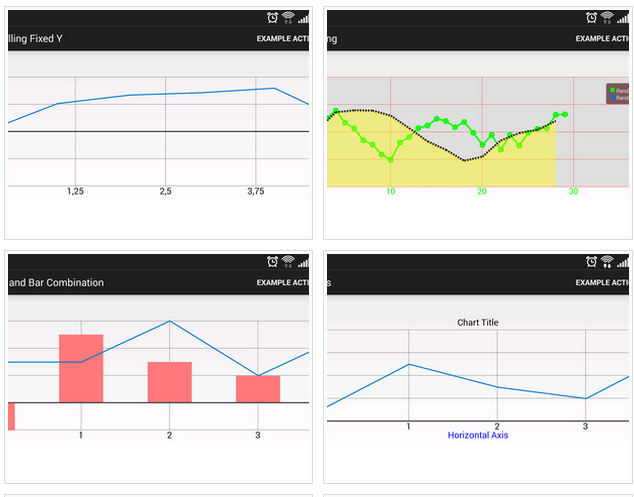

# Web Based Applications

The majority of this book is about native Android development, so why switch to web apps now?


### Quick "Native" Apps

There's a reputation in mobile that if you don't have an app, you're not prepared for the mobile space. Using a WebView and the native activity stack for navigation, web apps enable mobile sites to have a quick mobile app in the store.  This practice isn't allowed in iOS, but Google Play still allows it for published applications.

### JavaScript Libraries

Android is great.  The SDK contains components for almost everything you'd want to do in an app and there are a great deal of libraries to fill in the gaps.  Still, there are some things Android and Java don't do well.  Take a look at the following example:

|  |  |
| :--: | :--: |
| [GraphView](http://www.android-graphview.org/) | [d3js](https://d3js.org/) |

On the left is the open source GraphView library. While the library provides a native component that you can drop into your layout, it's limited in features.  On the right side is the open source D3 JavaScript library. D3 takes a bit longer to setup since it's in JavaScript and requires a WebView, but it provides far more functionality and customization than any available Java or Android library.

## Building Web Apps

Showing web content or local HTML/JS files is accomplished using the WebView class. This is a regular old view that you can drop into your layout in much the same way as you would a Button or TextView.  On its own, the WebView can show local HTML and JavaScript content. By adding the INTERNET permission to the manifest, a WebView can show web based content without any extra code.

In order to show HTML and JavaScript files locally, the files need to be added into the project. However, adding these files to the resource directory will cause them to get crunched down during compilation and not show properly. Instead, these files need to be located in the assets folder.  This folder isn't created for you by default but can be added by right clicking on your app module in Android Studio and selecting New -> Folder -> Assets Folder.

**Warning About the Assets Folder:** Any application resources added to the assets folder are at risk of being pirated by savvy user.  When building an APK, the Android compiler does not touch the files in the assets folder and they're included in the APK in their original form.  Since APK files are just ZIP files with a different extension, any user could grab your APK, change the extension, unzip it, and see everything in the assets folder.  Because of this, you should never include any sensitive data in files in the assets folder.

Consider the following example code:

```
// Grab the WebView like any other view.
WebView wv = (WebView)findViewById(R.id.webview);
    
// JavaScript must be enabled in order to execute.
WebSettings ws = wv.getSettings();
ws.setJavaScriptEnabled(true);
    
// Load a URL in the WebView.
wv.loadUrl("http://www.google.com");
    
// Load a file from the assets folder.
wv.loadUrl("file:///android_asset/index.html");
```
    
Assuming all other code is correct and our permissions are setup properly, if you run this code in an app, the WebView doesn't load any data. Instead, the native browser app on the device will open and load the given URL.  This happens because the WebView doesn't know how to handle loading links on its own. It needs a web client in order to handle this functionality.

### WebViewClient

In order for a WebView to be able to navigate to and between web pages, it needs to have a WebViewClient set.  The WebViewClient class allows a WebView to handle page loading events, block pages from loading, or redirect navigation events.  If your app isn't going to handle any custom navigation events, such as utilizing the native activity stack for navigation, then it's best to use a default WebViewClient object. However, if you need to handle custom events or redirect page loads, you must subclass the WebViewClient class.

##### WebViewClient Methods

* onPageStarted - Notifies the app that a page has started loading. The URL and favicon of the page is given for use in a custom address bar or ActionBar icon customization.
* onPageFinished - Notifies the app that a page has finished loading. URL of the page is given here.
* shouldOverrideUrlLoading - Gives the app an opportunity to take control before a URL is loaded by the WebView.  Custom navigation logic would typically stem from interrupting page loads in this method. Returns true if the app is taking over or false if the WebView should load the URL as normal.

```
WebView wv = (WebView)findViewById(R.id.webview);

// Set a default client for normal browsing.
wv.setWebViewClient(new WebViewClient());

// Creating a custom client for custom nav events.
public class MyClient extends WebViewClient {
    
    @Override
    public boolean shouldOverrideUrlLoading(WebView view, String url) {
        if(url.contains("www.example.com")) {
            // Do custom navigation here.
            return true;
        }
        return false;
    }
}

// Setting our custom client for custom nav handling.
wv.setWebViewClient(new MyClient());
```

### JavaScript Interfaces

In addition to simple link overriding, Android applications can also access and interface with JavaScript functionality using an interface object.  These same interface objects also allow JavaScript code to call methods that are written in native Java.

A JavaScript interface object is actually just a simple class or POJO (plain old Java object).  The class shouldn't explicitly extend any other class, but otherwise it's a normal class.  Inside of the class you would include any functionality that you want to expose to JavaScript.  Each method you want to expose should then be labeled with the `@JavaScriptInterface` annotation.

Instances of the interface object are attached to the WebView and given a string name.  The string name given to the object becomes the reference name in JavaScript. So if you had an interface object with a method called showToast() and you attached it to the WebView with the name "Android", your Java code would look like this:

```
// Define our JSInterface object with a method to show a toast.
public class WebInterface {
    @JavaScriptInterface
    public void showToast(String text) {
        Toast.makeText(context, text, Toast.LENGTH_SHORT).show();
    }
}

// Attach our JSInterface to the WebView.
WebView wv = (WebView)findViewById(R.id.webview);
wv.getSettings().setJavaScriptEnabled(true);
// Must assign a name to the JSInterface to reference it in JavaScript.
wv.addJavaScriptInterface(new WebInterface(), "Android");
```

Then in JavaScript, you'd call the method like so:

```
<!-- Define a JavaScript function for our form. -->
<script>
parseForm = function(event) {
    // Call our interface function to toast with the entered name.
    Android.showToast(document.forms["myForm"]["first_name"].value);
};
</script>

<!-- Form that uses our JavaScript function. -->
<form name="myForm" onsubmit="return parseForm()" >
    <input type="text" name="first_name" />
    <input type="submit" name="Submit" value="Submit" />
</form>
```

##### JavaScript Interface Limitations

Interfacing with JavaScript from Java isn't too bad in terms of setup, but it gets more complicated if you need to pass around complex data.  While JavaScript can handle primitive or simple Android types such as String, int, and boolean, it can't handle Java objects as parameters or return types.  However, JavaScript **does** understand how to interact with JSON, but it does so as a string.  So if you need to pass complex objects around, using JSON to represent the object is your best bet.

The other major warning has to do with how the interface executes methods on different threads.  While most operations commonly execute place on the main thread, interface functions are not guaranteed to be executed on the main thread in all cases.  If you need to alter the UI based on data returned from an interface function, be sure to post it to the main thread using a runnable or other solution.

### References

* [Android Developers: WebView Class](http://developer.android.com/reference/android/webkit/WebView.html)
* [Android Developers: Custom URL Handling](http://developer.android.com/guide/webapps/migrating.html#URLs)
* [Android Developers: Building Web Apps in WebView](http://developer.android.com/guide/webapps/webview.html)
* [Android Developers: Debugging Web Apps](http://developer.android.com/guide/webapps/debugging.html)