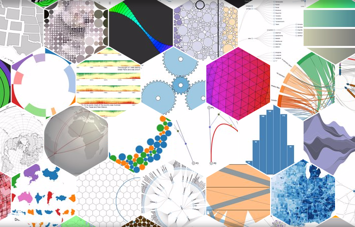

# Web Based Applications

The majority of this book is about native Android development, so why switch to web apps now?

### Quick "Native" Apps

There's a reputation in mobile that if you don't have an app, you're not prepared for the mobile space. Using a WebView and the native activity stack for navigation, web apps enable mobile sites to have a quick mobile app in the store.  This practice isn't allowed in iOS, but Google Play still allows it for published applications.

### JavaScript Libraries

Android is great.  The SDK contains components for almost everything you'd want to do in an app and there are a great deal of libraries to fill in the gaps.  Still, there are some things Android and Java don't do well.  Take a look at the following example:

|  |  |
| -- | -- |
| 
 [GraphView](http://www.android-graphview.org/) | 
[d3js](https://d3js.org/) |

On the left is the open source GraphView library. While the library provides a native component that you can drop into your layout, it's limited in features.  On the right side is the open source D3 JavaScript library. D3 takes a bit longer to setup since it's in JavaScript and requires a WebView, but it provides far more functionality and customization than any available Java or Android library.

## Implementation Details

