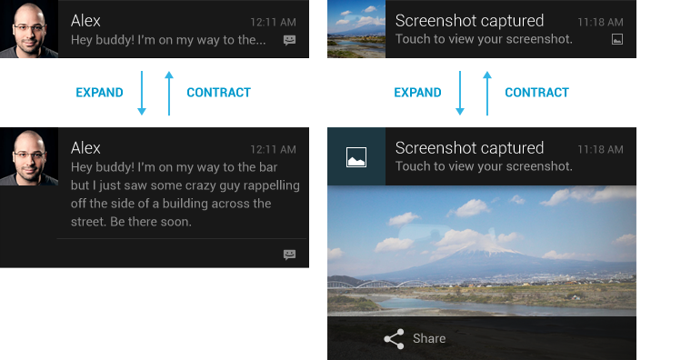

#Notifications
When your app isn't running, there will still be times where you might need to alert the user of some time sensitive information or event. To do this, you can use the notification system to send a message to the user and allow them to take some sort of action on that message.

Notifications are messages that can be displayed to the user outside of your application's UI. These messages will appear first as icons in the notification area of the status bar (left side). Once the user swipes down from the top of the screen to open the notification drawer, they will then be able to see the details of the notification message. The user can then click on your notification to perform a standard action defined by your app, click on an action item in the notification to take that specific action, or swipe left or right to dismiss the notification entirely. Below you can see the notification area and the notification drawer in that order.


##When to Use Notifications
Notifications are one of the most frequently abused features of the Android platform. Since notifications can be used to alert the user to events or information even when the app isn't running, or at least isn't in the foreground, developers tend to abuse notifications to keep the user thinking about their app, even when there's no reason to alert the user. You see, notifications interrupt whatever the user was doing and draws their attention to the status bar. If used effectively, the user will appreciate these interruptions as they'll only occur when something important or urgent happens. If abused, notifications can end up annoying the user with unimportant or irrelevant information or interruptions that are just too frequent.

As to not annoy the user, there are a few guidelines you should follow when deciding whether or not to show a notification. The first thing to consider is whether or not the information you want to show is time sensitive. If you have a message for the user that requires some sort of response, update, or interaction within a set period of time, let them know. In determine whether or not something is time sensitive, let the user have an input in that decision. For instance, calendar events allow the user to set when to show a reminder. By default, the calendar app assumes an appointment is time sensitive 30 minutes before the start of said appointment. However, the user can change this to say they want a reminder earlier or later, depending on how important the user thinks that appointment is to remember. If it's possible, or if it makes sense to let the user choose this value, let them choose.

The other guideline, or best practice, for showing a notification is if the message or alert involves another person. When a message or action involves another person, the typically means that somebody else is waiting for your input or waiting for you to take an action before they can complete what they were doing. When another person's time is involved, that makes a message more urgent and warrants showing a notification. For instance, when the user receives a text message, a notification is shown because that message came from another user who is likely waiting for a response. If a notification wasn't shown, the user wouldn't know to respond until they opened up their messaging app and saw the message from the other user.

With any type of notification, there's one more key guideline to follow, and that would be letting the user choose to not receive notifications. Even if you have time sensitive or personal notifications, the user might want to just ignore them altogether or at least ignore them for a period of time. You should always give the user the option to not see notifications for your app. By default, the user can disable all notifications for your app from the app info page in the system settings. However, the user might want to see some notifications, but not others. For this, you should have some sort of settings page in your app that allows the user to turn off certain types of notifications while leaving others enabled.

##Notification Components
There are two types of notifications, standard and expanded. Standard notifications are a simple type of notification that has been around since the very first version of Android. A standard notification layout contains five basic components: large image, title, message, timestamp, and secondary icon. The secondary icon is the image that's shown in the notification area before the user expands the notification drawer. Once expanded, the secondary icon appears in the bottom left of the notification to inform the user of which icon corresponds to which notification. The large image is the prominent image that appears on the left side of the notification layout. This image should describe the contents of the notification if possible, or contain the app icon at the very least. The title and message are standard bits of text, each one line long, that describe the message and the timestamp lets the user know when the notification was created.


In addition to standard notifications, starting in Android 4.1 (API 16) Jelly Bean, Android introduced expanded notifications to allow for richer messages and interaction on notification layouts. Expanded notifications allow for components such as expanded message text, action buttons, a single line of summary text below the message, or larger images. These features are only available in API 16 or higher so be sure to design your notifications to take advantage of these features if available, but also show relevant information in the standard layout for older devices.



##Building Notifications
There are two methods for building notifications, Notification.Builder and NotificationCompat.Builder. For our example, we'll be using the NotificationCompat version of the Builder class. The reason for this is NotificationCompat allows you to design your notifications to use the expanded and standard styles with any API version. If the device running your app doesn't support expanded notifications, it'll just ignore the expanded part of the notification. If you tried the same thing with the regular builder, your app would crash if you tried to show an expanded notification on older versions of Android.

First, we'll do a bit of setup. Each notification your app shows needs to have a unique integer ID so that it can be identified by your app and the system. We'll setup a couple of static final variables to create these identifiers. To show our notifications, we'll need to use the system's notification manager. We can get this as a system service using the NOTIFICATION_SERVICE constant of the Context class and cast the return value to a NotificationManager object. After that, we'll create our builder.

```
public static final int STANDARD_NOTIFICATION = 0x01001;
public static final int EXPANDED_NOTIFICATION = 0x01002;
...
// Assuming we're in a Context such as an Activity or Service.
NotificationManager mgr = 
	(NotificationManager)getSystemService(Context.NOTIFICATION_SERVICE);

NotificationCompat.Builder builder = new NotificationCompat.Builder(this);
```

The first type of notification we'll setup will be a standard notification. For this, we only need to define a few standard components. We'll setup our notification to have a title, a message, a small icon, and a large icon. The title and message are simple string values. The small icon is an identifier for a drawable resource while the large icon is an actual Bitmap image. If no large icon is provided, the small icon will be used in both places. Once we set all of our properties, we can build the notification and show it to the user using the notification manager.

```
public static final int STANDARD_NOTIFICATION = 0x01001;
public static final int EXPANDED_NOTIFICATION = 0x01002;
...
NotificationManager mgr = 
	(NotificationManager)getSystemService(Context.NOTIFICATION_SERVICE);

NotificationCompat.Builder builder = new NotificationCompat.Builder(this);
builder.setSmallIcon(R.drawable.ic_notification);
builder.setLargeIcon(BitmapFactory.decodeResource(
	getResources(), R.drawable.ic_launcher));
builder.setContentTitle("Standard Title");
builder.setContentText("Standard Message");
mgr.notify(STANDARD_NOTIFICATION, builder.build());
```

If you run this code using the attached example project, you'll notice that the small icon is not exactly the same as the app icon. Notification small icons should be all white and transparency as to match the Android design guidelines. To get icons that match this style, you can use the Notification Icon Generator that's part of Android Asset Studio. This is integrated into Android Studio and can also be found at the link in the resources section of this lesson.

Now, if we wanted to switch our notification to use an expanded style, we can add a few extra properties to our existing standard implementation. To make our notification expanded, we have to set a "Big" style to it. There are three big styles you can use to make expanded notifications, BigTextStyle, BigPictureStyle, and InboxStyle. We'll take a look at the BigTextStyle in this example, but feel free to explore the other two styles on your own.

The first thing we need to do is create a new BigTextStyle object. Then we can use this much like a builder and set some properties. The big style has three properties that can be used to change the look of the notification. The first is the big text property. This is the large block of text you want to show in the notification. You can also set a big title which is shown in place of the regular title when the notification is expanded. Lastly, you can set a line of summary text that describes the overall message of your notification.

```
public static final int STANDARD_NOTIFICATION = 0x01001;
public static final int EXPANDED_NOTIFICATION = 0x01002;
...
NotificationManager mgr = 
	(NotificationManager)getSystemService(Context.NOTIFICATION_SERVICE);

NotificationCompat.Builder builder = new NotificationCompat.Builder(this);
builder.setSmallIcon(R.drawable.ic_notification);
builder.setLargeIcon(BitmapFactory.decodeResource(
	getResources(), R.drawable.ic_launcher));
builder.setContentTitle("Standard Title");
builder.setContentText("Standard Message");
BigTextStyle bigStyle = new BigTextStyle();
bigStyle.bigText("Some really long text goes here.");
bigStyle.setBigContentTitle("Expanded Title");
bigStyle.setSummaryText("Expanded Summary");
builder.setStyle(bigStyle);
mgr.notify(EXPANDED_NOTIFICATION, builder.build());
```

If we were to show the above expanded notification, it would appear exactly as the standard notification if it wasn't the first item in the drawer. If it was the first item, the title would change to be the big title and the message would change to be the big text with the summary listed underneath.


##Setting Actions on Notifications
In addition to just showing messages, notifications also allow you to also set an action that happens when the notification is clicked or you can set some action buttons that perform certain actions when they're clicked instead of the default notification action. To set these actions, you need to create pending intents. Pending intents will be covered more in the Pending Intents lesson, so we'll just cover how to set them to a notification here.

The first type of action you can set is the default notification action. When the user clicks on a notification, something should happen. Typically, this action is to open the app that created the notification and show data that is related to the notification. For instance, if you receive a text message then you'll get a notification that has the contents of the text message. If you click on that notification, you're taken to the text messaging app and right into the conversation shown on the notification. Your actions should always have that sort of context.

```
NotificationCompat.Builder builder = new NotificationCompat.Builder(this);
PendingIntent pIntent; 
// Create your default action intent
// Setting the default action.
builder.setContentIntent(pIntent);
```

The second type of action you can set to a notification is an action button. Action buttons are only available on platforms that support expanded notifications. You don't need to create an expanded notification to get action buttons, but action buttons won't show up on platforms prior to API 16. As with the default action, action buttons use pending intents to define what happens when those actions are clicked. Action buttons can also have an icon and a label. The icons used for these actions should match the same style as action bar icons. Additionally, the actions performed by action buttons should be distinctly different from the default action. Typically, the secondary action buttons perform some sort of action in a service and don't require the app to even be opened to perform said action.

```
NotificationCompat.Builder builder = new NotificationCompat.Builder(this);
PendingIntent pIntent; 
// Create your default action intent
// Setting the default action.
builder.addAction(android.R.drawable.ic_menu_delete, "Delete", pIntent);
```

####References
http://romannurik.github.io/AndroidAssetStudio/icons-notification.html
http://developer.android.com/reference/android/support/v4/app/NotificationCompat.Builder.html
http://developer.android.com/guide/topics/ui/notifiers/notifications.html
http://developer.android.com/design/patterns/notifications.html
http://developer.android.com/training/notify-user/expanded.html
