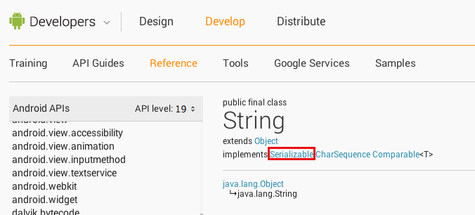

#Serializable
Using file streams to save data out to files works well enough string data. Need to save out and read back in some JSON, XML, or lines of text? File streams and stream readers are perfect for the job. What if you want to save an entire object or list of objects? You could first convert your object to key/value pairs in JSON and save that out. If you had a list then you could convert each object to JSON and store them all in a JSON array and store that out as a string. However, that's a lot of work just to save and load some objects. Instead, we can use object serialization to make this easier.

Object serialization is the process of saving an entire object out to a file. The process of saving the object is quite easy, however, it doesn't work for all objects. In order for object serialization to work, you need to first have a serializable object.

##Serializable Objects
Serializable objects are just like any other object. However, the class definition of a serializable object must fulfill three requirements in order to make the objects created with that class serializable:

1. The class must implement the Serializable interface.
2. The class must have a private static final long named
3. serialVersionUID that holds a unique identifier for the class.

All members of the class must also be serializable.
Fulfilling the first two requirements of serializable objects is quite simple. The Serializable interface definition contains no methods that need to be implemented. For this, you need only add "implements Serializable" to the end of your class declaration. Adding in the version UID is also easy as you're just declaring a new private static final long at the top of your class, you never need to do anything with it. If you're using Eclipse and your class implements the Serializable interface, Eclipse will prompt you to create this identifier and you can even have Eclipse generate it for you. It's important to note that you should make every version UID the same for every object as this identifier is used to determine if two serializable objects are compatible.

```
import java.io.Serializable;
public class Employee implements Serializable {
	private static final long serialVersionUID = 8736847634070552888L;
}
```

The last requirement of creating a serializable object has the highest potential for error. When creating serializable objects, you need to make sure that all members of the class are also serializable. Well how do you know what is and isn't serializable? By default, all basic and primitive types are serializable. That means that your class can contain as many boolean, char, byte, short, int, long, float, double, and String members as you want and your object will still be serializable. To determine if any other types are serializable, you'll need to view the documentation. On every class reference page, at the top, you'll see the name of the class, what that class extends, and what interfaces that class implements. If you're not sure if a class type is serializable, check the documentation. Also keep in mind that when extending a class, the subclass also implements all interfaces. So if you don't see the "implements Serializable" declaration in the class reference, look at the parent class as well.



###Saving and Loading Serializable Objects
Now that you have an understanding of how to create a serializable object, let's look at how to save these out and load them back in. In order to save a serializable object out to a file, we first need to do our file output setup. This looks the same as it would for any other file output.

```
// Our serializable object
Employee employee = new Employee();
	
try {
	// Creating a file stream that points to an internal storage file.
	FileOutputStream fos = openFileOutput("test.dat", Context.MODE_PRIVATE);
} catch (Exception e) {
	e.printStackTrace();
}
```

Now that we have a file stream, instead of writing to the file directly using the file stream, we'll wrap that stream in an ObjectOutputStream. ObjectOutputStream is a special type of stream used to write serializable objects to any other type of stream in a way that makes it easy to rebuild the object. Once we wrap out stream, we'll use the writeObject() method of the ObjectOutputStream to write the object to the file. Then we just close our stream like normal.

```
Employee employee = new Employee()
	
try {
	FileOutputStream fos = openFileOutput("test.dat", Context.MODE_PRIVATE);
	
	// Wrapping our file stream.
	ObjectOutputStream oos = new ObjectOutputStream(fos);
	
	// Writing the serializable object to the file
	oos.write(employee);
	
	// Closing our object stream which also closes the wrapped stream.
	oos.close();
} catch (Exception e) {
	e.printStackTrace();
}
```

That's it for writing out serializable objects. As you can see, it's only one more line of code than if we were to save text or byte data to a file. However, the real benefit comes on the reading side. With text or byte files, we have to setup buffers and use stream readers. With serializable objects, it's much simpler. Like with saving objects, we'll start by setting up our regular file stream.

```
try {
	// Opening our file for reading.
	FileInputStream fin = openFileInput("test.dat");
} catch(Exception e) {
	e.printStackTrace();
}
```

Now that we have our file stream opened, we'll wrap it with an ObjectInputStream. Just like the ObjectOutputStream class is used to write objects out in an easy to rebuild manner, the ObjectInputStream is used to reassemble those objects and read them back in. We can read in objects using the readObject() method of the ObjectInputStream class. This method returns a generic Object type, so we'll need to cast our read object. After that, we can close the stream as we normally would.

```
try {
	FileInputStream fin = openFileInput("test.dat");
	
	// Wrapping our stream
	ObjectInputStream oin = new ObjectInputStream(fin);
	
	// Reading in our object
	Employee emp = (Employee)oin.readObject();
	// Closing our object stream which also closes the wrapped stream.
	oin.close();
} catch(Exception e) {
	e.printStackTrace();
}
```

That's it for reading in an object. As you can tell, the code for reading an object from a file is a lot shorter and a lot less complex than reading in a text file. Serializable objects can't be used for all data storage such as images, for example, but it's a good way to store complex data types in an easy to read and easy to write manner.

####References
http://developer.android.com/reference/java/io/Serializable.html
http://developer.android.com/reference/java/io/ObjectInputStream.html
http://developer.android.com/reference/java/io/ObjectOutputStream.html
