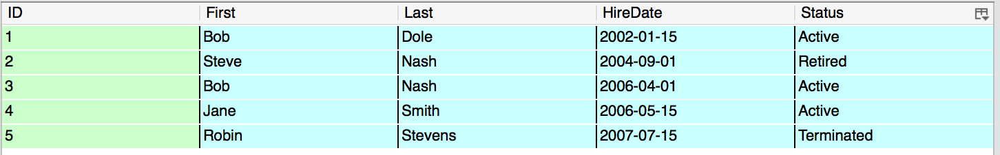

#SQLite

##Data Tables
Data is organized into two-dimensional tables of rows and columns. Columns define the type of being stored and what that data represents. Rows represent a single data entry that is composed of the data points represented by the columns. 

###Primary Keys
Every table should contain a column which holds a unique identifier for each row in the table known as a Primary key.  In general, these keys are represented by an integer value that auto increments when a new row is added to the table.

###Data Types
* TEXT - Any sort of string and/or character data.
* INTEGER - A whole number represented by an int, short, byte, or long.
* REAL - A floating point number represented by a float or a double.
* DATETIME - A string that represents a date formatted as “yyyy-MM-dd HH:mm”.
* BLOB - Raw byte data stored as a collection of bytes.
 
####Example Table


###Creating a Table
Tables are creating using a “CREATE TABLE” statement and are named using a string value that does not contain spaces. The table name is followed by the column names and types, separated by commas, and listed within parentheses.

Create a table of articles that stores the title, description, publish date, and the URL of the story.

```
CREATE TABLE IF NOT EXISTS articles (
	_id INTEGER PRIMARY KEY AUTOINCREMENT,
	title TEXT,
	description TEXT,
	publish_date DATETIME,
	url_string TEXT
)
```

###Querying a Table (SELECT)
Queries are performed using a SELECT statement. The SELECT statement is formatted as the command SELECT, followed by the data fields (columns) in a comma separated list, followed by the table or tables that house the data.

Assuming a table named “articles” and we want to fetch all article titles from a column named “title”:

```
SELECT title FROM articles
```

####Filter the Selection (WHERE)

A SELECT statement will return all rows in a table by default. Returned rows can be filtered using a WHERE clause. WHERE statements are formatted as the command WHERE, then column name(s) a comparison operator, then column value(s).  This WHERE clause is placed after the SELECT statement as the statement tail. String values are wrapped in quotes while numerical values contain no quotes.

To get all articles named “test” from the table above:
```
SELECT title FROM articles WHERE title=‘test’
```

The WHERE clause can also be filtered using a wildcard (%) and the LIKE keyword for string values. Standard <, >, <=, >=, != operators can be used for numeric values. != works for strings as well. Can combine multiple WHERE clauses with AND/OR keywords. 

To get all articles starting with the word “test” or containing the word “example”:
```
SELECT title FROM articles WHERE title LIKE ‘test%’ OR title LIKE ‘%example%’
```
###Soring Query Results
Query results can be sorted by adding an ORDER BY statement to the end of the SELECT statement, after the WHERE clause if included. ORDER BY statements are followed by the column name and either ASC or DESC for ascending or descending order. Only  INTEGER, TEXT, or REAL columns should be used for sorting to get a reliable sort behavior.  

Sorting all articles by title name in ascending order:
```
SELECT title FROM articles ORDER BY title ASC
```

