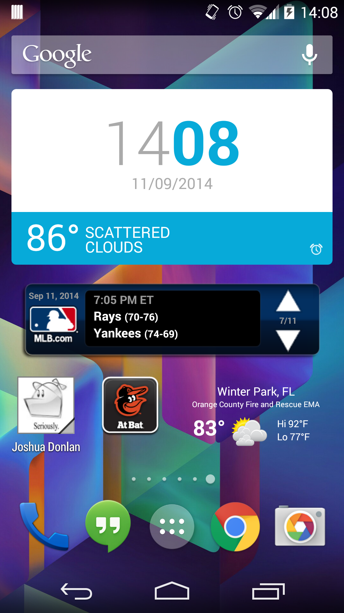

#Home Screen Widgets
One of the biggest benefits users have on Android over other platforms is the ability to easily customize their home screen experience. Like most other platforms, users can move around their icons and group apps togethers into folders. However, Android users have the added benefit of being able to enhance their home screen experience through the use of widgets. Widgets are an "at-a-glance" view of an app's most important data or functionality. They allow you to view data from within an app or take actions through the use of shortcut buttons displayed directly to your home screen.

While Android has had home screen widgets since the beginning (API 3), more recently, other mobile platforms have begun launching their own widget solutions. Starting in iOS 8, Apple has allowed applications to customize the notification area of iOS devices with custom notification widgets. These widgets are similar in functionality to Android widgets, but they're confined to only showing up in notification center instead of on the home screen. Additionally, Windows Phone 7.1 and 8 both have the ability to create "live tiles" on the home screen. These live tiles can show a specific piece of data and perform a single action, but cannot be extended to show multiple data points or perform multiple actions based on user selections like with Android.

##Widget Types
There are four (really three) types of home screen widgets that you can build to compliment the functionality of your application. Each widget type has a defined purpose and is used in different situations. Read through the different widgets types and think about how each one could be applied to the different apps you've created throughout the Java/Android courses.

###Information Widgets
Information Widgets
Information widgets are used to display crucial app information that a user would want immediate access to. This information would typically change on a consistent basis or over a period of time. This type of widget works out great for stock tickers, weather widgets, and score tracking apps. When this type of widget is clicked, the typical response would be to open the associated app and navigate into a details view that shows a more in-depth look at the widget data. For instance, if your widget shows the current weather, clicking on that widget would then take the user to a more detailed forecast with an hourly breakdown.

###Collection Widgets
Collection widgets are used, as the name implies, to view a collection of data in a single widget view. This type of widget integrates some sort of AdapterView to show a collection of data directly to your app's home screen. This type of widget serves two main purposes. The first is the ability to browse the collection as a whole. The second would be to open an element within the collection directly into an app's detail view. So in the instance of the built-in Gmail widget, you can perform two actions. The first action is the ability to scroll through the contents of your inbox while the second is the ability to click on a single email and open the details of that message within the Gmail application. This type of widget is good for any collection of data such as emails, messages, appointments, bookmarks, or image galleries. When creating this type of widget, make sure that you're showing a collection of data that has the ability to change. There's no point in having a widget that shows a collection of static data as widgets are meant to show immediate changes in data and static data doesn't change.

###Control Widgets
Control widgets allow the user to take an action with a single click. These are actions that exist within your app, but they might take a few clicks to access those actions. If this is an action that the user is going to take on a frequent basis, it might make more sense to bubble this up into a widget. For instance, consider the process for enabling or disabling WiFi on an Android device. Without a widget, the quickest way to turn on WiFi is to open the notification drawer, flip to the settings drawer, click the WiFi button to open the settings app, and change the WiFi switch to on. That's four steps just to turn on WiFi. With a control widget though, we could make a single button to toggle WiFi and put that button on the home screen. Then the user can click a single button from the home screen to turn WiFi on or off.

###Hybrid Widgets
Hybrid widgets are just a combination of any of the other three widget types. Not all widgets will fall into one of the previous three defined categories. Most widgets will typically fall into either the information or collection category but also have control elements as well. Consider a music player widget. Player widgets are primarily control widgets that allow you to perform start/stop and skip operations on the player. However, they also fall into the information widget category by showing the currently playing song.

####References
https://developer.android.com/design/patterns/widgets.html
